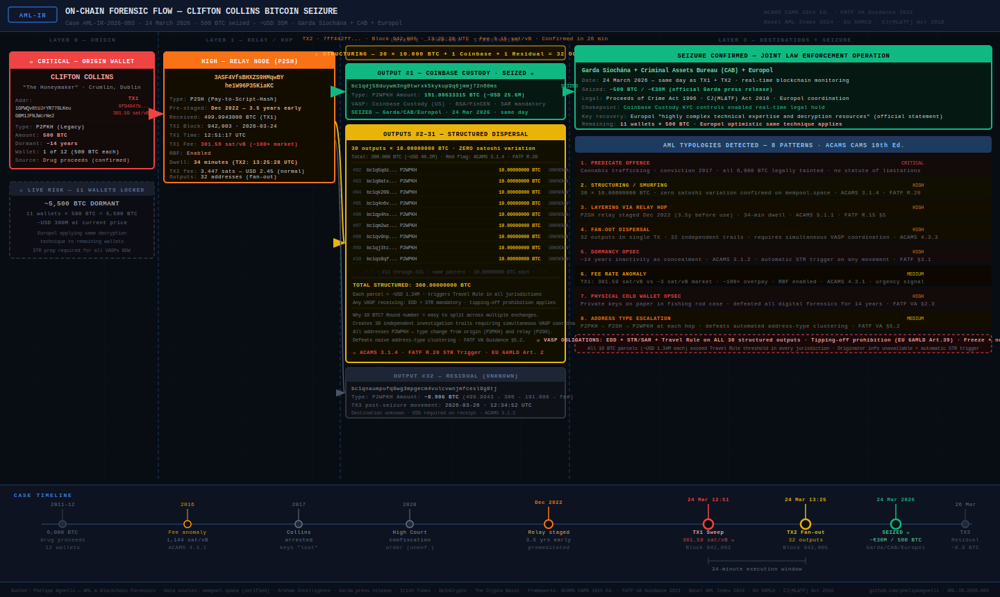

# 14 Years of Silence: On-Chain Forensic Analysis of the Clifton Collins Bitcoin Seizure

**Report:** AML-IR-2026-003 · **Author:** Phelipe Agnelli · **Date:** March 2026  
**Data:** mempool.space (verified) · Arkham Intelligence · Garda Síochána official press release  
**Frameworks:** ACAMS CAMS 10th Ed. · FATF VA Guidance 2021 · EU 6AMLD · CJ(ML&TF) Act 2010

---

---

## Background

Clifton Collins, a Dublin cannabis trafficker convicted in 2017, accumulated **6,000 BTC** between 2011–2012 using drug proceeds (~USD 30,000 total). He split the holdings across **12 wallets of 500 BTC each**, storing private keys on paper inside a fishing rod case. When arrested, his landlord cleared the property — the keys were assumed destroyed. The Irish High Court ordered confiscation in 2020, but without the keys, the order was unenforceable.

On **24 March 2026**, Wallet #1 of 12 moved. Europol recovered the keys using *"highly complex technical expertise and decryption resources"* and the same technique is expected to work on the remaining 11 wallets (~5,500 BTC, ~USD 390M).

---

## The Two Transactions — 34 Minutes

**TX1 — Sweep** · Block 942,003 · 12:51:17 UTC  
`9f94847b...76c130`  
Origin → Relay · 499.9943 BTC · **Fee: 301.59 sat/vB (~100× market)** · RBF enabled

**TX2 — Fan-Out** · Block 942,005 · 13:25:28 UTC  
`7ff442ff...a69bd`  
Relay → 32 outputs · Fee: 3.15 sat/vB (normal)

| Output | Amount | Destination | Status |
|--------|--------|-------------|--------|
| #1 | **191.08633315 BTC** | Coinbase Custody `bc1qdj58...60ms` | **SEIZED ✓** |
| #2–#31 | **10.00000000 BTC × 30** | Unknown bc1q addresses | Structuring ⚠ |
| #32 | ~8.906 BTC | `bc1qnaum...8tj` | Unknown |

---

## What They Were Trying to Do

**Conceal the origin:**
- P2SH relay address pre-staged **December 2022 — 3.5 years before use** (ACAMS 5.1.1)
- Address type escalation **P2PKH → P2SH → P2WPKH** defeats automated clustering (FATF §5.2)
- 14 years of dormancy as concealment strategy (ACAMS 3.1.2)

**Fragment and distribute:**
- 30 outputs of **exactly 10.00000000 BTC — zero satoshi variation** (ACAMS 3.1.4)
- Creates 30 independent investigation trails requiring simultaneous VASP coordination
- Each parcel ~USD 1.34M — above Travel Rule threshold in every jurisdiction

**Why it failed:** The integration phase requires a regulated VASP. Directing 191 BTC to Coinbase Custody — a BSA/FinCEN-regulated entity — created the chokepoint. Real-time blockchain monitoring by Europol enabled seizure on the same day.

---

## AML Typologies — 8 Patterns

| # | Typology | Framework | Risk |
|---|----------|-----------|------|
| 1 | Predicate offence — drug trafficking | CJ(ML&TF) Act 2010 · EU 6AMLD | Critical |
| 2 | Structuring — 30 × 10 BTC, zero variance | ACAMS 3.1.4 · FATF R.20 | High |
| 3 | Relay hop layering — P2SH, 3.5y pre-staged | ACAMS 5.1.1 · FATF R.15 §5 | High |
| 4 | Fan-out dispersal — 32 outputs, single TX | ACAMS 4.3.3 | High |
| 5 | Dormancy OPSEC — 14 years | ACAMS 3.1.2 · FATF §3.1 | High |
| 6 | Fee anomaly — 301.59 sat/vB (~100× market) | ACAMS 4.3.1 | Medium |
| 7 | Physical cold wallet — paper key, fishing rod | FATF VA §2.3 | High |
| 8 | Address type escalation — P2PKH→P2SH→P2WPKH | FATF VA §5.2 | Medium |

---

## Live Risk: 11 Wallets Still Locked

~5,500 BTC (~USD 390M) remain dormant. Any VASP should act now:

- Add Collins entity addresses to screening watchlists (Arkham Intel)
- Configure real-time alerts for any movement from known addresses
- Pre-prepare STR templates — predicate confirmed, typologies known
- Apply Travel Rule + EDD on any 10 BTC deposit from post-March 2026 bc1q addresses
- **Do not tip off** — EU 6AMLD Art. 39 / CJ(ML&TF) Act 2010

---

## Verify On-Chain

- TX1: [mempool.space/tx/9f94847b...](https://mempool.space/tx/9f94847b72944e5525d8581aeed60a9f03ada4e1fbe33ee1efcbf4784776c130)
- TX2: [mempool.space/tx/7ff442ff...](https://mempool.space/tx/7ff442ffca11e2a65e6b31b8c69afd15a5cbca77414e3ba746c1bf597bca69bd)
- Collins entity: [Arkham Intelligence](https://intel.arkm.com/explorer/entity/clifton-collins)
- Official seizure: [Garda press release, 24 Mar 2026](https://www.garda.ie/en/about-us/our-departments/office-of-corporate-communications/press-releases/2026/march/seizure-of-30-million-cryptocurrency-criminal-assets-bureau-cab-europol-24th-march-2026.html)

---

*AML-IR-2026-003 · Phelipe Agnelli — AML & Blockchain Forensics*  
*Data verified at mempool.space · Published for educational purposes*
