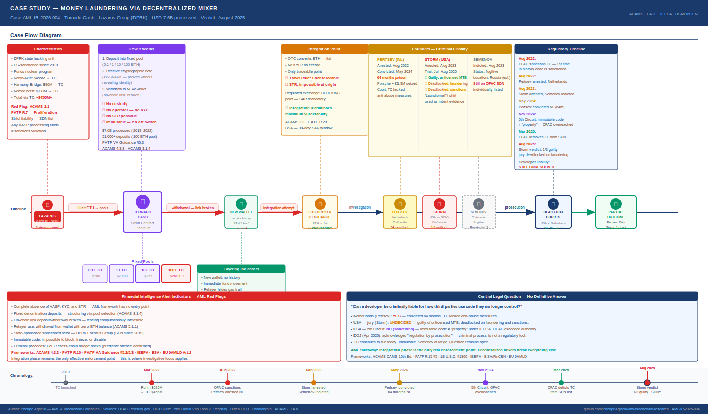

# When Code Goes to Trial: An AML Investigator's Analysis of Tornado Cash

**Report:** AML-IR-2026-002 · **Author:** Phelipe Agnelli · **Date:** May 2026  
**Sources:** OFAC Treasury.gov · DOJ SDNY · 5th Circuit (Van Loon v. Treasury) · Dutch FIOD · Chainalysis  
**Frameworks:** ACAMS CAMS 10th Ed. · FATF VA Guidance 2021 · IEEPA · BSA/FinCEN · 18 U.S.C. §1960

---

---

## Case Overview

Tornado Cash is a decentralized privacy protocol deployed on the Ethereum network in 2019. Between 2019 and 2022, it processed **USD 7.6 billion in ETH**. Approximately 18% — around **USD 1.5 billion** — came from confirmed illicit sources. The primary threat actor was the **Lazarus Group**, North Korea's state-sponsored hacking unit, which used the protocol to launder proceeds from three major DeFi attacks.

In this report, I walk through each phase of the operation from an AML investigator's perspective — identifying applicable red flags, reporting obligations, and the points where conventional compliance frameworks worked and where they broke down entirely.

---

## Phase 1 — Predicate Offence: The Hacks

### What happened

The Lazarus Group executed three attacks on DeFi bridge protocols between March and August 2022, generating the funds that would be laundered through Tornado Cash:

| Hack | Date | Total Stolen | Sent to TC |
|------|------|-------------|------------|
| Ronin Bridge (Axie Infinity) | Mar 2022 | **USD 625M** | **~USD 455M** |
| Harmony Horizon Bridge | Jun 2022 | USD 100M | **USD 96M** |
| Nomad Bridge | Aug 2022 | USD 190M | **USD 7.8M** |

These proceeds directly fund North Korea's ballistic missile and nuclear weapons programs — making this a national security case, not only an AML matter.

### Investigator's analysis

**Red flags at this stage:**

> **ACAMS 2.1 — Predicate Offence Identification**  
> The criminal origin of the funds is confirmed from the moment of the hack. Any wallet receiving funds traceable to the attacker's address must be treated as tainted from the first on-chain transaction.

> **FATF R.7 — Targeted Financial Sanctions (Proliferation Financing)**  
> The Lazarus Group has been on OFAC's SDN list since 2019. Any VASP processing transactions from addresses linked to this entity is in direct sanctions violation — regardless of whether the VASP was aware of the origin. This is strict liability.

**What should have been done:**  
At this stage, I would expect VASPs to have configured real-time alerts for any transaction originating from the attacker's known addresses. Tools such as Chainalysis KYT and TRM Labs allow investigators to flag contaminated ETH within seconds of a hack being confirmed. Any deposit traceable to those addresses requires immediate blocking and STR/SAR filing — with no exceptions based on value thresholds.

**Why it failed:**  
The funds did not flow to a regulated exchange. They went directly into Tornado Cash. Without a VASP, there is no KYC, no reporting obligation, and no human operator to receive a freeze order. The entire AML reporting chain has no entry point here.

---

## Phase 2 — Placement: The Deposit into the Mixer

### What happened

The Lazarus Group deposited funds into Tornado Cash's fixed-denomination pools — primarily the 100 ETH pool (~USD 260,000 per deposit). The protocol works as follows:

1. User deposits a fixed amount (0.1 / 1 / 10 / 100 ETH) into the smart contract pool
2. User receives a cryptographic note generated by a **zk-SNARK** proof
3. The note proves a valid deposit exists — without revealing which deposit belongs to which user
4. With up to 51,000 deposits in the largest pool, linking a specific withdrawal to its corresponding deposit is computationally infeasible

### Investigator's analysis

**Red flags at this stage:**

> **FATF VA Guidance 2021, §5.3 — Use of Anonymizing Services**  
> The use of a mixer is itself a high-risk indicator. Any funds that have passed through Tornado Cash must be treated as of unknown origin until proven otherwise. I apply this as an automatic risk escalation — no additional evidence required.

> **ACAMS 4.3.3 — Layering via Anonymizing Services**  
> The transfer of funds to an anonymization service is a classic layering technique. At this stage, I document the origin address, the amount, the timestamp, and the pool denomination used.

> **ACAMS 3.1.4 — Structuring**  
> The use of fixed denominations — particularly multiple deposits of 100 ETH — constitutes structuring. The denomination is not accidental. The 100 ETH pool carries the largest anonymity set and was selected to maximize privacy, not for any legitimate operational reason.

**What should have been done:**  
An investigator with access to blockchain analytics tools can identify pool entry addresses and trace their origin back to the hack events via TXID chain analysis. Chainalysis Reactor and Arkham Intelligence support cluster analysis that identifies behavioral patterns even when the direct cryptographic link is severed.

In my investigative documentation at this stage, I would record:
- Origin address (traceable to the hack via TXID chain)
- Pool used (100 ETH = maximum anonymity = highest risk)
- Deposit frequency (multiple deposits = structuring pattern)
- Timestamp relative to the hack (temporal proximity = additional red flag)

**Why it failed:**  
There is no VASP at this stage. The smart contract has no operator, no KYC process, and no reporting obligation. The entire AML framework assumes a human intermediary who can be compelled to act. That intermediary does not exist here.

> **Investigative note:** This is the fundamental architectural gap that the Tornado Cash case exposed. FATF Travel Rule (R.16) requires VASPs to transmit originator and beneficiary information. But who is the VASP in this scenario? The smart contract is not a legal entity. It has no physical address and no license. The Travel Rule has no recipient.

---

## Phase 3 — Layering: The Withdrawal

### What happened

The note holder withdraws funds to a **completely new address** — no prior history, no ETH balance, no on-chain connection to the original deposit. The protocol also supports a **Relayer** service: a third party that pays the gas fee on behalf of the withdrawer, allowing the withdrawal to occur from a wallet with zero ETH balance. This eliminates even the indirect linkage that would exist if the user had to fund gas from their original wallet.

### Investigator's analysis

**Red flags at this stage:**

> **FATF VA Guidance 2021, §5.2 — Unhosted Wallet Risk**  
> Transactions from unhosted wallets with no identifiable history require Enhanced Due Diligence when the transaction value is material. A new wallet receiving 100 ETH with no prior activity is an immediate red flag that I flag for review regardless of any other context.

> **ACAMS 3.1.2 — Sudden Activity After Inactivity**  
> A wallet that receives significant value with no prior history and immediately moves the funds is a textbook layering pattern. The absence of any holding period indicates the wallet was created solely for this transaction.

> **ACAMS 5.1.1 — Relay/Hop Pattern**  
> The use of a Relayer to eliminate even the gas trail is a sophisticated evasion indicator. The actor is demonstrably aware of investigative tracing techniques and is actively countering each one.

**What should have been done:**  
At this stage, I focus on behavioral pattern analysis rather than cryptographic tracing — because the cryptographic link is mathematically broken. I document:
- New wallet → receives value from TC → moves immediately → no holding period
- This behavioral pattern alone, even without confirmed origin, supports a STR filing based on reasonable suspicion
- The Relayer should be investigated as a potential facilitator and documented separately

**Why it failed:**  
The zk-SNARK proof mathematically severs the link between deposit and withdrawal. Even with the best available blockchain analytics tools, it is not possible to prove on-chain which specific deposit corresponds to which specific withdrawal. Investigators work with probabilities and behavioral indicators — not cryptographic certainty.

---

## Phase 4 — Integration: Converting to Fiat

### What happened

This is the phase where the AML framework has some practical effectiveness. The Lazarus Group needed to convert ETH into fiat currency. That process inevitably requires touching a regulated point of the financial system — an exchange, an OTC broker, or a payment service. OFAC and DOJ enforcement efforts concentrated on this stage.

### Investigator's analysis

**Red flags at this stage:**

> **ACAMS 2.3 — Integration via Regulated VASP**  
> A large ETH deposit at a regulated exchange, originating from wallets with no history or with a history traceable to a mixer, constitutes an unambiguous STR/SAR obligation. The VASP does not need to prove the origin — reasonable suspicion is sufficient to trigger the filing requirement.

> **FATF R.20 — Suspicious Transaction Reporting**  
> Funds traceable — even indirectly — to sanctioned addresses activate reporting obligations regardless of amount. The presence of the Lazarus Group on the SDN list transforms any related transaction into a potential sanctions violation under strict liability.

> **BSA/FinCEN — SAR Filing Obligation (30-day window)**  
> FinCEN-registered exchanges have 30 days to file a SAR after identifying suspicious activity. Funds from addresses linked to Tornado Cash with a layering behavioral pattern — new wallet, immediate movement, high value — satisfy the reasonable suspicion standard.

**What should have been done:**  
The compliance analyst at the receiving exchange should have:
1. Screened the depositing address against OFAC SDN and other sanctions lists
2. Verified the wallet's transaction history via blockchain analytics
3. Identified the TC linkage as an automatic high-risk escalation
4. Applied EDD: source of funds, account holder identity, stated purpose of transaction
5. If EDD not satisfied: freeze the funds and file SAR
6. Notify the FIU without alerting the client — tipping-off prohibition applies (EU 6AMLD Art. 39 / BSA)

**Why it worked here:**  
The integration phase is the only point where the actor is forced to expose themselves. Converting ETH at scale into fiat requires touching the regulated financial system. Regulated exchanges that cooperated with law enforcement — including Coinbase — enabled the enforcement actions that led to prosecutions. This is the lesson I draw from this phase: mixers break the on-chain trail, but they do not solve the fundamental problem of converting criminal proceeds into usable currency.

---

## Phase 5 — The Legal Breakdown: When the Framework Cannot Reach

### What happened

In August 2022, OFAC made an unprecedented decision: it sanctioned the Tornado Cash code — not a person, not a company, but a set of immutable smart contracts published on a public blockchain. The response exposed a fundamental legal contradiction.

**November 2024 — 5th Circuit (Van Loon v. Treasury):**  
The court ruled that immutable smart contracts are not "property" under IEEPA — because no person retains control over them after deployment. OFAC exceeded its statutory authority.

**August 2025 — Roman Storm verdict (SDNY):**  
The jury convicted Storm of operating an unlicensed money transmitting business but deadlocked on the more serious charges — money laundering conspiracy and sanctions violations. The central question remained unanswered: can a developer be criminally liable for how third parties use code they no longer control?

### Investigator's analysis

**What this legal deadlock means in practice:**

> **ACAMS — Developer Liability Gap**  
> The AML framework was built on the premise of intermediary responsibility. When the intermediary is autonomous code, there is no recipient for KYC, STR, and Travel Rule obligations. This is not a regulatory gap — it is an architectural absence.

> **FATF R.15 — New Technologies**  
> FATF requires countries to proactively assess risks created by emerging technologies. The Tornado Cash case demonstrates that this assessment needs to happen before deployment — not after USD 7.6 billion has been processed.

**What I document when TC appears in a transaction flow:**

When I identify Tornado Cash in a fund's transaction history, my investigative documentation includes:

1. **STR limitation disclosure:** I document that on-chain origin cannot be confirmed due to zk-SNARK — but that the behavioral pattern supports reasonable suspicion for filing
2. **Automatic high-risk rating:** Any funds with TC history receive a HIGH risk rating regardless of value
3. **Mandatory EDD:** The customer must explain source of funds without relying on on-chain traceability — documents, contracts, declarations
4. **FIU coordination:** Cases involving sanctioned actors (Lazarus Group) require notification to the relevant financial intelligence unit beyond the standard STR
5. **Limitation disclosure in the report:** I explicitly document what could not be traced and why — this protects both the analyst and the VASP in regulatory audits

---

## AML Typologies Identified

| # | Typology | Phase | Framework | Risk |
|---|----------|-------|-----------|------|
| 1 | Predicate offence — DeFi bridge hack | Placement | ACAMS 2.1 · EU 6AMLD Art.2 | Critical |
| 2 | Layering via decentralized mixer | Layering | ACAMS 4.3.3 · FATF R.16 | High |
| 3 | On-chain link severance (zk-SNARK) | Layering | FATF VA Guidance §5.3 | High |
| 4 | Structuring via fixed denomination pools | Placement | ACAMS 3.1.4 · FATF R.20 | High |
| 5 | Relayer use — zero gas balance withdrawal | Layering | FATF VA Guidance §5.2 | High |
| 6 | State-sponsored sanctioned actor (SDN list) | All phases | OFAC IEEPA · FATF R.7 | Critical |
| 7 | Absence of VASP — unhosted wallet risk | All phases | FATF R.15 §5 · BSA | High |
| 8 | Immutable code — impossible to block or freeze | All phases | FATF R.15 (new tech) | Critical |

---

## Investigative Conclusions

Three takeaways I apply from this case to any investigation involving decentralized privacy protocols:

**1. Integration is always the criminal's weak point.**  
Regardless of how sophisticated the mixer is, the funds eventually need to re-enter the real economy. That is where enforcement is possible and where I focus my investigative effort.

**2. Blockchain analytics does not resolve everything — but it documents everything.**  
Even when the cryptographic link is broken, behavioral patterns, timestamps, and address clusters build the investigative case. I document what I can confirm and what I cannot — both carry evidentiary value.

**3. The AML framework requires legislative updates — not only enforcement.**  
The DOJ acknowledged it was "regulating by prosecution." OFAC lost in court. That does not mean TC prevailed — it means the wrong tools were applied. Legislation specifically addressing non-custodial protocols is the necessary next step, and as an analyst I need to be aware that my reporting obligations in this space will evolve as that legislation develops.

> Tornado Cash continues to run today. The code is immutable. Roman Semenov remains a fugitive. The developer liability question has no definitive answer. And more sophisticated privacy protocols are already in operation.

---

## Verify & References

- OFAC sanctions announcement (Aug 8, 2022): [treasury.gov/jy0916](https://home.treasury.gov/news/press-releases/jy0916)
- DOJ indictment Storm + Semenov: [justice.gov](https://www.justice.gov/usao-sdny)
- 5th Circuit ruling Van Loon: [ca5.uscourts.gov](https://www.ca5.uscourts.gov)
- Chainalysis TC analysis: [chainalysis.com](https://www.chainalysis.com/blog/tornado-cash-ofac-designation-sanctions/)
- Mayer Brown verdict analysis: [mayerbrown.com](https://www.mayerbrown.com/en/insights/publications/2025/08/the-tornado-cash-trials-mixed-verdict-implications-for-developer-liability)

---

*AML-IR-2026-004 · Phelipe Agnelli — AML & Blockchain Forensics*  
*All data from public sources: OFAC, DOJ, court records, Chainalysis. Published for educational purposes.*

