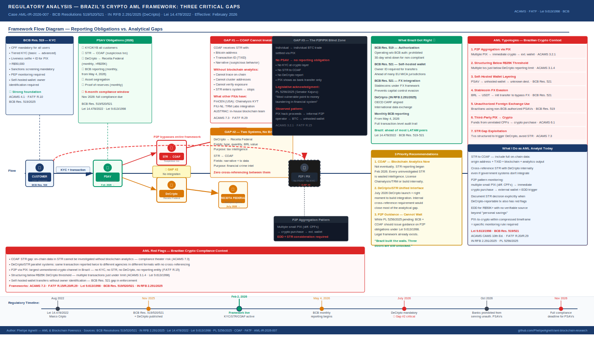

# Three Gaps in Brazil's 2026 Crypto AML Framework: A Practitioner's Analysis

**Report:** AML-IR-2026-005· **Author:** Phelipe Agnelli · **Date:** May 2026  
**Sources:** BCB Resolutions 519/520/521 (2025) · IN RFB 2.291/2025 (DeCripto) · Lei 14.478/2022 · PL 5256/2025 · COAF · FATF Mutual Evaluation Brazil  
**Frameworks:** ACAMS CAMS 10th Ed. · FATF Recommendations · Lei 9.613/1998 · BCB Resolution 521/2025 · GENIUS Act 2025 (comparative)

---

---

## Context: Brazil Just Built One of Latin America's Best Crypto Frameworks

In November 2025, the Central Bank of Brazil (BCB) published Resolutions 519, 520, and 521 — the most comprehensive cryptocurrency regulatory framework in Latin American history. Effective February 2, 2026, these resolutions brought Virtual Asset Service Providers (PSAVs) under the same regulatory architecture as traditional financial institutions.

The framework established mandatory KYC for all users, AML/CFT policies aligned with Lei 9.613/1998, suspicious transaction reporting (STR) to COAF, monthly transaction reporting to BCB, asset segregation requirements, and sanctions screening obligations.

Simultaneously, the Federal Revenue Service published IN RFB 2.291/2025 — the "DeCripto" — aligning Brazil with the OECD's Crypto-Asset Reporting Framework (CARF) and mandating monthly reporting of all crypto transactions above R$35,000 starting July 2026.

On paper, this is a serious and well-constructed regulatory response. Brazil deserves credit for building it.

In this report, I document three structural gaps in this framework that, in my assessment as an AML analyst, will be found and exploited before regulators close them.

---

## Gap 1 — COAF Receives STRs It Cannot Investigate

### The problem

Every PSAV operating in Brazil is now legally required to file Suspicious Transaction Reports (STRs) with COAF — Brazil's Financial Intelligence Unit — whenever a transaction presents red flags of money laundering or terrorist financing.

This is the correct obligation. The problem is what happens on the other side of that report.

COAF is a financial intelligence unit built for traditional financial crime — bank transfers, cash transactions, real estate deals. When an exchange files an STR that says *"customer deposited 2 BTC originating from address 1GPWQv8...Ne2 which has prior exposure to darknet markets"*, COAF receives a Bitcoin address and a transaction ID. Without blockchain analytics tools — Chainalysis, TRM Labs, or equivalent — that information cannot be investigated. The STR enters the system and stops there.

There is no public evidence that COAF has integrated professional blockchain analytics into its investigative workflow. Brazil's FATF Mutual Evaluation Report noted capacity gaps in financial intelligence. The new framework creates reporting obligations without creating the analytical infrastructure to act on those reports.

### What I document from this gap

When I file an STR for a crypto transaction under the Brazilian framework, I include:

- The on-chain address of origin and destination
- The TXID of the suspicious transaction
- The blockchain (Bitcoin, Ethereum, etc.)
- The behavioral red flags that triggered the report
- Any blockchain analytics tool output I have access to

But I have no visibility into whether that information is actionable on the receiving end. Filing an STR into a system that cannot process it provides legal protection for the reporting PSAV — but it does not generate the intelligence that should be the purpose of the report.

### The AML implication

> **ACAMS 7.3 — Effectiveness of STR Programs**  
> An STR program is only as effective as the analytical capacity of the receiving Financial Intelligence Unit. Reporting obligations without analytical infrastructure create a compliance theater — the appearance of AML, without its substance.

**What needs to happen:**  
COAF needs to integrate blockchain analytics capability — either by licensing tools directly or by establishing a formal cooperation protocol with PSAVs that have those tools. The model already exists in other jurisdictions: FinCEN (USA), FIU-Netherlands, and AUSTRAC (Australia) all have blockchain analytics integrated into their investigative workflows. Brazil is behind on this specific capability.

---

## Gap 2 — DeCripto and STR Are Two Parallel Systems That Do Not Talk to Each Other

### The problem

A PSAV operating in Brazil in 2026 has two separate, parallel reporting obligations:

**To the Federal Revenue Service (Receita Federal):**
Monthly DeCripto reports via e-CAC, covering all transactions above R$35,000, with fields including: type of operation, asset type, quantity, value in BRL, and counterparty identification. Format: structured data aligned with OECD CARF standard. Purpose: tax compliance and fiscal intelligence.

**To COAF:**
STR filings whenever a transaction presents AML/CFT red flags, with a narrative section describing the suspicious behavior. Format: free-text narrative + transaction data. Purpose: financial crime intelligence.

These two systems are operated by different government agencies, use different data formats, have different thresholds, serve different purposes, and have no documented integration between them.

### The specific gap

A transaction that generates both a DeCripto report (because it exceeds R$35,000) and an STR (because it presents red flags) is reported twice, to two different systems, in two different formats, with no automatic cross-referencing.

This means:
- The Receita Federal sees the fiscal data but not the suspicion narrative
- COAF sees the suspicion narrative but not the full fiscal data trail
- Neither agency automatically sees what the other has

A sophisticated money launderer who understands this gap can structure activity to generate DeCripto reports (appearing fiscally compliant) while avoiding the behavioral patterns that would trigger STR filing — exploiting the analytical blind spot between two systems.

### What I document from this gap

> **FATF R.29 — Financial Intelligence Units**  
> FATF Recommendation 29 requires that FIUs have access to the widest possible range of financial, administrative, and law enforcement information. A fragmented reporting architecture where fiscal data and suspicion data sit in separate, non-integrated systems directly undermines this recommendation.

> **ACAMS 7.1 — Information Sharing**  
> Effective AML requires that information gathered through different reporting channels be consolidated for analysis. The DeCripto/STR split is an architectural barrier to this consolidation.

**What needs to happen:**  
Brazil needs a unified crypto transaction intelligence layer — a single system or integration protocol that allows both agencies to cross-reference DeCripto fiscal data with COAF STR suspicion narratives. The EU's AMLA (Anti-Money Laundering Authority), launching in 2025-2026, provides a model for this kind of cross-agency data integration. Brazil should adopt a similar architecture before the DeCripto mandatory reporting begins in July 2026.

---

## Gap 3 — The P2P/PIX Blind Zone

### The problem

The BCB Resolutions 519/520/521 regulate PSAVs — companies that provide crypto services to third parties. They do not regulate peer-to-peer transactions between individuals.

In Brazil, a significant volume of Bitcoin and other cryptocurrency transactions occur through P2P channels — direct trades between individuals, settled via PIX. These transactions:

- Do not pass through a regulated PSAV
- Generate no KYC record at the crypto layer
- Generate no STR obligation (there is no obligated reporting entity)
- Generate no DeCripto report
- Are visible only as PIX transfers at the banking layer — without any indication that the PIX funded a crypto purchase

From a Brazilian AML perspective, P2P crypto via PIX is currently the largest unmonitored transaction channel in the crypto ecosystem.

### The legislative acknowledgment

Senator Jorge Kajuru presented PL 5256/2025 specifically acknowledging this gap, stating that direct P2P crypto transactions represent *"the most vulnerable point to money laundering"* in the Brazilian financial system. The bill proposes requiring all crypto purchases and sales to be intermediated by authorized PSAVs — effectively ending unregulated P2P trading.

The bill has not been enacted. Until it is, the gap remains.

### The PIX hacking connection

In mid-2025, a series of cyberattacks exploited vulnerabilities in PIX infrastructure connected to third-party service providers. Investigators found that stolen funds were being routed through informal P2P crypto operators — using PIX to purchase Bitcoin from unregulated traders, who then transferred the Bitcoin to unhosted wallets without generating any AML record.

The pattern is structurally identical to the integration phase of traditional money laundering: convert illicit cash to a bearer asset through an unregulated intermediary. The technology is different; the typology is the same.

### What I document from this gap

> **FATF R.15 — New Technologies Risk Assessment**  
> FATF requires that countries identify and assess money laundering risks associated with new payment technologies. P2P crypto via PIX is a new payment channel that currently falls outside the FATF-compliant reporting framework in Brazil.

> **ACAMS 3.2.1 — Peer-to-Peer Transaction Risk**  
> Transactions between unidentified parties without a regulated intermediary are a documented high-risk typology. The absence of a reporting obligation does not reduce the ML risk — it removes the detection mechanism.

**What I document for compliance purposes:**  
When a PSAV customer's transaction history shows a pattern of small PIX inflows followed immediately by crypto purchases and external wallet transfers, I treat this as a potential P2P aggregation pattern — collecting funds from multiple informal P2P transactions and consolidating them into exchange deposits. This pattern warrants EDD and STR consideration even when individual transactions appear below threshold.

---

## The Framework Strengths: What Brazil Got Right

Before closing, I document what the new framework gets right — because the gaps do not negate the progress.

**Mandatory PSAV authorization:** Operating a crypto exchange in Brazil without BCB authorization is now prohibited, with a strict 30-day wind-down requirement. This eliminates the previous environment where any entity could offer crypto services without regulatory oversight.

**Self-hosted wallet identification:** BCB Resolution 521/2025 explicitly requires PSAVs to identify the owner in transfers to self-hosted wallets. This is ahead of many jurisdictions — including several EU member states still implementing MiCA — in addressing the Travel Rule gap for unhosted wallets.

**Foreign exchange coverage:** Stablecoin transactions and international transfers are now integrated into Brazil's foreign exchange reporting framework — a critical step that prevents crypto from being used to circumvent capital controls.

**Monthly BCB reporting:** PSAVs must submit detailed monthly reports on purchases, sales, and stablecoin exchanges to BCB from May 4, 2026. This creates a transaction-level audit trail that does not exist for traditional cash.

**9-month transition period:** PSAVs have until November 2026 to demonstrate full compliance. This is a reasonable timeline that allows legitimate operators to build compliance infrastructure without forcing immediate shutdown.

---

## What an AML Analyst Should Do Today

Given these three gaps, I document the following practical adaptations for compliance analysts operating in the Brazilian crypto AML environment:

**For STR filing to COAF:**
1. Include full on-chain data — originating address, TXID, blockchain, and any analytics tool output you have access to. Make it as actionable as possible for an investigator who may not have blockchain tools
2. Cross-reference the STR with the corresponding DeCripto data in your internal records — even if the systems don't integrate, your compliance file should
3. Document the blockchain analytics methodology you used — this creates an audit trail and establishes the investigative standard for your institution

**For P2P exposure monitoring:**
4. Flag customers who receive multiple small PIX transfers from different CPFs, immediately followed by crypto purchases and external transfers — this is the P2P aggregation pattern
5. Apply EDD to customers who cannot explain the source of funds beyond "personal savings" for transactions above R$50,000
6. Configure transaction monitoring rules specifically for the PIX-to-crypto sequence within compressed timeframes

**For DeCripto/STR parallel obligations:**
7. Maintain a unified internal log that links DeCripto reports to STR decisions — even if the government systems don't talk to each other, your compliance file should
8. When a DeCripto-reportable transaction also presents STR red flags, document explicitly why an STR was or was not filed — this is your regulatory defense if audited

---

## AML Typologies Specific to the Brazilian Context

| # | Typology | Brazilian Context | Framework | Risk |
|---|----------|------------------|-----------|------|
| 1 | P2P aggregation via PIX | Multiple PIX → immediate crypto purchase → external wallet | ACAMS 3.2.1 · FATF R.15 | High |
| 2 | Structuring below R$35,000 DeCripto threshold | Multiple transactions just below reporting threshold | ACAMS 3.1.4 · Lei 9.613/1998 | High |
| 3 | Self-hosted wallet layering | PSAV → unhosted wallet → unknown destination | BCB Res. 521 · FATF R.16 | High |
| 4 | Foreign exchange via stablecoin | BRL → USDT → international transfer to avoid FX controls | BCB Res. 521 · Lei 9.069/1995 | Critical |
| 5 | Unauthorized exchange use | Brazilian customers using non-authorized foreign PSAVs | BCB Res. 519 · FATF R.15 | Medium |
| 6 | PIX-crypto conversion by third party | Funds received from unrelated CPFs → crypto purchase | ACAMS 6.1 · FATF R.10 | High |
| 7 | STR gap exploitation | Transactions designed to trigger DeCripto without triggering STR | ACAMS 7.3 · FATF R.20 | High |

---

## Conclusions

Brazil built a serious regulatory framework for crypto AML in 2025-2026. The BCB Resolutions, the DeCripto, and the self-hosted wallet identification requirement are genuine advances that put Brazil ahead of many comparable jurisdictions.

But three structural gaps — COAF's analytical capacity, the DeCripto/STR integration failure, and the P2P/PIX blind zone — create exploitable spaces that a sophisticated actor will find before the regulator closes them.

Three things I would prioritize if I were advising on this framework:

**1. COAF needs blockchain analytics now.** Not eventually — now. The mandatory STR reporting from PSAVs began in February 2026. Every STR that COAF cannot investigate on-chain is a wasted intelligence report.

**2. DeCripto and STR need a unified interface.** The July 2026 DeCripto launch is the right moment to build this integration. A single internal cross-referencing requirement — even without full system integration — would close most of the analytical gap.

**3. P2P regulation cannot wait for PL 5256/2025.** While the bill is under consideration, BCB and COAF should issue guidance specifically addressing the P2P/PIX typology and establishing what obligations informal P2P operators carry under Lei 9.613/1998. The legal framework to act already exists — it needs to be applied.

> *Brazil built a serious regulatory foundation in 2025-2026 — one of the most comprehensive in Latin America. Closing these three gaps would make it one of the most effective globally.*

---

## References

- BCB Resolution 519/2025: [bcb.gov.br](https://www.bcb.gov.br/estabilidadefinanceira/exibenormativo?tipo=Resolução%20BCB&numero=519)
- BCB Resolution 521/2025: [bcb.gov.br](https://www.bcb.gov.br/estabilidadefinanceira/exibenormativo?tipo=Resolução%20BCB&numero=521)
- IN RFB 2.291/2025 (DeCripto): [gov.br/fazenda](https://www.gov.br/fazenda/pt-br/assuntos/noticias/2025/novembro/receita-federal-atualiza-regulamentacao-de-criptoativos-para-adapta-la-ao-padrao-internacional)
- Lei 14.478/2022 (Marco Cripto): [planalto.gov.br](https://www.planalto.gov.br/ccivil_03/_ato2019-2022/2022/lei/l14478.htm)
- PL 5256/2025 (P2P restriction proposal): Senate of Brazil
- FATF Mutual Evaluation — Brazil: [fatf-gafi.org](https://www.fatf-gafi.org/en/publications/Mutualevaluations/Brazil.html)
- COAF: [gov.br/coaf](https://www.gov.br/coaf)

---

*AML-IR-2026-005 · Phelipe Agnelli — AML & Blockchain Forensics*  
*All regulatory references are public documents. Analysis reflects the author's independent assessment. Published for educational purposes.*
