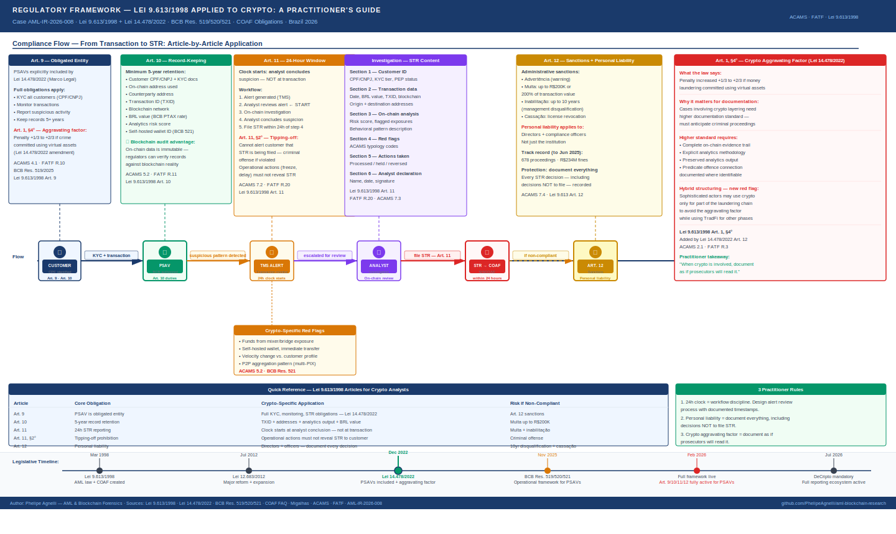

# Applying Brazil's AML Law to Crypto: What Lei 9.613/1998 Actually Requires from a Practitioner's Perspective

**Report:** AML-IR-2026-006 · **Author:** Phelipe Agnelli · **Date:** May 2026  
**Sources:** Lei 9.613/1998 · Lei 14.478/2022 (Marco Legal dos Ativos Virtuais) · Lei 12.683/2012 · BCB Resolutions 519/520/521 · COAF FAQ (gov.br/coaf) · Migalhas — "Atores e Desafios no Combate à Lavagem de Dinheiro" (Oct 2025)  
**Frameworks:** ACAMS CAMS 10th Ed. · FATF Recommendations · COAF Instrução Normativa nº 7

---

---

## Why This Matters for Every Crypto AML Analyst in Brazil

Every job posting for AML compliance roles at Brazilian exchanges, fintechs, and PSAVs lists Lei 9.613/1998 as a required knowledge area. It is the foundational piece of Brazil's anti-money laundering architecture — the law that created COAF, defined the crime of money laundering, and established the obligations of every regulated entity.

What those job postings do not explain is how to apply a law written in 1998 — for banks, real estate agents, and jewelry dealers — to a world of Bitcoin addresses, THORChain swaps, and DeFi protocols.

In this report, I walk through the articles of Lei 9.613/1998 that matter most for crypto compliance practitioners, explain what they actually require in an on-chain context, and document how I apply them in practice. This is not a legal commentary — it is an operational guide for analysts who need to do their jobs under this framework every day.

---

## The Law and Its Crypto Update: What Changed in 2022

Lei 9.613/1998 was Brazil's original AML law, substantially reformed in 2012 by Lei 12.683/2012. For most of its history, it applied to traditional financial sectors — banks, securities firms, insurance companies, real estate agents, and others listed in Art. 9.

The **Marco Legal dos Ativos Virtuais (Lei 14.478/2022)** changed this in two critical ways:

**First**, it formally included PSAVs (Virtual Asset Service Providers) in the list of entities subject to Lei 9.613/1998 obligations under Art. 9. This means every exchange, broker, and crypto payment processor in Brazil is now explicitly obligated to apply KYC, maintain records, and report suspicious transactions to COAF — the same obligations that banks have carried for decades.

**Second**, it added a specific aggravating factor to the money laundering crime itself: under Art. 1, §4°, the penalty for money laundering is increased by one third to two thirds **if the crime is committed using virtual assets**. This reflects the legislature's recognition that crypto-enabled laundering is more difficult to detect and prosecute — and it has direct implications for how analysts document their cases.

These two changes transform Lei 9.613/1998 from a background legal reference into an active operational framework for every crypto compliance professional in Brazil.

---

## Article 9: Who Is Obligated — and What That Means for PSAVs

### What the law says

Art. 9 of Lei 9.613/1998 lists the categories of persons subject to its obligations. Following Lei 14.478/2022, PSAVs — defined as entities that provide virtual asset services as a regular business activity — are explicitly included.

### What this means in practice

Every PSAV authorized by the BCB under Resolutions 519/520/521 carries the full set of Art. 9 obligations. This includes:

- **Art. 10 obligations:** Maintaining customer identification records (KYC), keeping transaction records for a minimum of 5 years, and monitoring customer activity for suspicious patterns
- **Art. 11 obligations:** Reporting suspicious transactions to COAF and reporting cash transactions above defined thresholds

These are not optional best practices — they are legal obligations with criminal and administrative sanctions attached.

### The practical gap I document

Art. 9 covers authorized PSAVs. It does not — currently — cover informal P2P operators, decentralized protocols, or individuals who regularly buy and sell crypto as an unregistered business. This is the same gap documented in AML-IR-2026-007 (Brazil's Three Gaps). As an analyst, when I see a customer whose transaction history suggests they are aggregating funds from informal P2P trades before depositing at our exchange, I treat that upstream activity as a high-risk indicator — even though the P2P operator themselves has no Art. 9 obligation today.

> **ACAMS 4.1 — Know Your Customer**  
> KYC obligations under Lei 9.613/1998 Art. 10 require not just identity verification at onboarding but ongoing monitoring of customer behavior. A customer whose transaction pattern changes significantly — for example, sudden large deposits after months of inactivity — triggers a review obligation under Art. 10, regardless of whether the individual transaction exceeds a reporting threshold.

---

## Article 10: The Record-Keeping Obligation — Adapted for Blockchain

### What the law says

Art. 10 requires obligated entities to maintain records of all transactions and customer identification data for a minimum of 5 years from the conclusion of the transaction or the closure of the account. It also requires monitoring of customer transactions and activity to identify unusual patterns.

### What this means for crypto

In a traditional bank, a transaction record consists of account number, amount, date, and counterparty. In crypto, a complete transaction record under Art. 10 includes:

- Customer CPF/CNPJ and KYC documentation
- The on-chain address used by the customer
- The counterparty address (destination or source)
- The Transaction ID (TXID)
- The blockchain network (Bitcoin, Ethereum, etc.)
- The value in BRL at the time of the transaction (using BCB PTAX rate for foreign currency assets)
- The blockchain analytics risk score at the time of the transaction (if applicable)
- Any self-hosted wallet identification required under BCB Res. 521/2025

### What I document in practice

For every transaction above my institution's defined monitoring threshold, my Art. 10 record includes all of the above. I treat the blockchain analytics output — even if it only provides a risk score and not a definitive attribution — as part of the official record. If that record is ever requested by COAF, the BCB, or a court, the completeness of the on-chain data demonstrates that the compliance function was operating properly.

The 5-year retention requirement has particular significance in crypto: blockchain data is immutable and permanently accessible, which means regulators can verify whether a PSAV's internal records match the on-chain reality at any point within the retention window. This is a stronger audit capability than exists in traditional finance, and it creates accountability in both directions.

> **ACAMS 5.2 — Transaction Monitoring**  
> Art. 10 monitoring obligations require a risk-based approach. In crypto, this means configuring transaction monitoring systems to flag not just high-value individual transactions but also behavioral patterns — velocity changes, fan-out from a single wallet, cross-chain bridge activity — that individually may fall below thresholds but collectively indicate suspicious behavior.

---

## Article 11: The Reporting Obligation — The 24-Hour Question

### What the law says

Art. 11 requires obligated entities to report suspicious transactions to COAF. The clock starts not at the moment of the transaction, but at the moment the analyst **concludes** that the transaction is suspicious. The standard reporting window is 24 hours from that conclusion.

This distinction is critical and frequently misunderstood.

### The 24-hour window in a crypto context

In a crypto environment, a transaction that is suspicious may not be identifiable as such at the moment it occurs. A customer deposits 5 ETH — which is not suspicious on its own. Three hours later, blockchain analytics identifies that the source wallet has prior exposure to a sanctioned entity. The 24-hour clock starts when the analyst receives and reviews that alert — not when the original deposit occurred.

This creates a practical workflow requirement:

1. **Alert generation:** Transaction monitoring system generates an alert
2. **Initial review:** Analyst reviews the alert — this is the starting point of the 24-hour window
3. **Investigation:** Analyst traces the on-chain history, checks analytics tool output, reviews customer profile
4. **Decision:** Analyst concludes whether the transaction is suspicious
5. **Filing:** If suspicious, STR must be filed with COAF within 24 hours of Step 4

Missing this window is a sanctionable offense under Art. 12 — fines, temporary disqualification of the responsible officer, or suspension of the institution's operating license.

### What I document when I file an STR under Art. 11

My STR narrative for a crypto transaction includes:

**Section 1 — Customer identification**  
CPF/CNPJ, account opening date, KYC tier, PEP status, previous STR history

**Section 2 — Transaction data**  
Date, value in BRL, blockchain, TXID, origin address, destination address

**Section 3 — On-chain analysis**  
Risk score from blockchain analytics tool, exposure to flagged entities (if any), transaction pattern description (e.g., "funds received from address with prior THORChain activity, immediately transferred to external unhosted wallet within same session")

**Section 4 — Red flags identified**  
Specific ACAMS typology codes and behavioral indicators that triggered the report

**Section 5 — Actions taken**  
Whether the transaction was processed, held, or reversed; whether the customer was notified (noting that tipping-off prohibition under Art. 11, §2° applies)

**Section 6 — Analyst declaration**  
My name, registration number, date of conclusion of suspicion, and signature

This structure ensures that even if COAF cannot independently investigate the on-chain data (as documented in AML-IR-2026-007), the report itself creates a complete evidentiary record.

> **FATF R.20 — Suspicious Transaction Reporting**  
> FATF requires that STRs be filed promptly and contain sufficient information to allow the FIU to analyze the report. Including full on-chain data — TXID, addresses, analytics output — satisfies this requirement and goes beyond the minimum legal threshold.

---

## Article 11, §2°: The Tipping-Off Prohibition

### What the law says

Art. 11, §2° prohibits the communicating entity from alerting the customer that a report has been filed or is being considered. Violation of this prohibition is itself a criminal offense.

### The specific crypto challenge

In crypto, tipping-off can happen inadvertently through operational actions. If a PSAV freezes a customer's account, delays a withdrawal, or requests additional KYC documentation at the same time it is filing an STR, the customer may correctly infer that a report is being prepared.

### What I do in practice

When I am simultaneously filing an STR and taking operational action on an account, I document the timing carefully. If the operational action (freeze, delay) is taken for independently justifiable compliance reasons — for example, a routine EDD review triggered by a threshold breach — I document that justification separately and ensure it is not linked to the STR process in customer-facing communications.

The rule of thumb I apply: **the customer should not be able to infer from any operational action that a report has been filed.** Any communication to the customer during the STR window is reviewed by the compliance officer before being sent.

---

## Article 12: Sanctions — What the Director Risks Personally

### What the law says

Art. 12 establishes the sanctions for non-compliance with Art. 10 and Art. 11 obligations. Critically, these sanctions apply not only to the institution but also **personally to its directors and officers** responsible for compliance.

The sanctions range from:
- Advertência (formal warning) for procedural violations
- Multa (fine) of up to R$200,000 or up to 200% of the transaction value
- Inabilitação temporária (temporary disqualification from management roles) for up to 10 years for serious violations
- Cassação da autorização (revocation of operating license) for repeat violations

### What this means for a crypto compliance professional

The personal liability provision of Art. 12 is the most important reason to understand Lei 9.613/1998 deeply — not superficially. As of June 2025, COAF had applied R$234 million in fines across 678 administrative proceedings. These are real sanctions with real consequences for real people.

For a compliance analyst or officer at a Brazilian PSAV, this means:

**Document everything.** Every STR decision — including decisions not to file — must be documented with the reasoning. The burden of proof in an Art. 12 proceeding is on the institution to demonstrate that its procedures were adequate and were followed.

**The "I didn't know" defense is weak.** Art. 12 sanctions apply for failure to comply with obligations, not just for willful non-compliance. A poorly configured transaction monitoring system that misses a reportable pattern is not a defense — it is a compliance failure.

**Know the thresholds for your sector.** Different sectors have different reporting thresholds under COAF's sector-specific regulations. For PSAVs, the applicable thresholds are set by BCB Resolutions 519/520/521 and COAF's own guidance for the crypto sector.

> **ACAMS 7.4 — Personal Liability of Compliance Officers**  
> Art. 12's personal liability provision is consistent with the global trend of holding compliance officers personally accountable for program failures. This reinforces the importance of maintaining documented, defensible compliance decisions — not just compliant outcomes.

---

## The Aggravating Factor: Art. 1, §4° and Its Investigative Implications

The 2022 amendment that added the crypto aggravating factor has a direct impact on how I document cases that may eventually become criminal referrals.

When I file an STR for a transaction that involves crypto layering — for example, funds moving from an exchange deposit through multiple DEX swaps to a mixer and then to an external wallet — I am documenting not just a suspicious transaction but potentially the elements of a crime that carries an aggravated penalty.

This means my documentation needs to be at a higher standard than a routine STR. Specifically:

- The on-chain evidence trail needs to be complete and independently verifiable
- The blockchain analytics methodology needs to be explicitly described
- The connection between the reported transaction and the suspected predicate offence should be documented where identifiable
- All data should be preserved in a form that could be used as evidence in a criminal proceeding

The aggravating factor also creates an incentive for sophisticated actors to structure their crypto laundering to avoid meeting its criteria — for example, by using crypto only for a portion of the laundering chain while using traditional financial channels for others. This hybrid structuring pattern is worth documenting as a separate red flag.

---

## Practical Summary: What Lei 9.613/1998 Requires from a Crypto Analyst

| Article | Core Obligation | Crypto-Specific Application |
|---------|----------------|----------------------------|
| Art. 9 | PSAV is an obligated entity | Full KYC, monitoring, and STR obligations apply |
| Art. 10 | Maintain records for 5 years | Include TXID, addresses, analytics output, BRL value |
| Art. 11 | Report suspicious transactions within 24h | 24h starts when analyst concludes suspicion — not at transaction |
| Art. 11, §2° | No tipping-off | Operational actions must not reveal STR to customer |
| Art. 12 | Sanctions — including personal liability | Document every decision, including decisions not to file |
| Art. 1, §4° | Crypto aggravating factor | Higher documentation standard for cases involving virtual assets |

---

## Conclusions

Lei 9.613/1998 is not a relic — it is an actively evolving framework that now explicitly covers every authorized PSAV in Brazil. The 2022 amendments brought crypto inside the law, not outside it.

Three things I apply from this framework in my daily practice:

**1. The 24-hour window is a workflow discipline.**  
It requires a structured alert review process with documented timestamps. In crypto, where on-chain events happen in seconds and analytics tools generate alerts in minutes, the 24-hour clock is manageable — but only if the workflow is designed for it.

**2. The personal liability provision makes documentation non-negotiable.**  
Every STR decision, every threshold review, every EDD conclusion must be documented with the reasoning. The analyst who documents well is protected even when outcomes are imperfect. The analyst who does not document is exposed even when outcomes are good.

**3. The aggravating factor changes the investigative standard.**  
When crypto is involved in a potential laundering case, the documentation standard should anticipate criminal proceedings — not just regulatory review. Complete on-chain evidence trails, explicit methodology descriptions, and preserved analytics outputs are not just good practice; they are the foundation of a case that prosecutors can actually use.

> *Lei 9.613/1998 was written for a world without blockchains. The 2022 amendments brought crypto inside the law. The practitioner's job is to apply the spirit of the obligation — complete, accurate, timely reporting — with the tools and data that blockchain provides.*

---

## References

- Lei 9.613/1998 (texto integral): [planalto.gov.br](https://www.planalto.gov.br/ccivil_03/leis/l9613.htm)
- Lei 14.478/2022 (Marco Legal): [planalto.gov.br](https://www.planalto.gov.br/ccivil_03/_ato2019-2022/2022/lei/l14478.htm)
- Lei 12.683/2012 (reforma 9.613): [planalto.gov.br](https://www.planalto.gov.br/ccivil_03/_ato2011-2014/2012/lei/l12683.htm)
- COAF FAQ: [gov.br/coaf](https://www.gov.br/coaf/pt-br/acesso-a-informacao/perguntas-frequentes-3)
- BCB Resolution 519/2025: [bcb.gov.br](https://www.bcb.gov.br/estabilidadefinanceira/exibenormativo?tipo=Resolução%20BCB&numero=519)
- Migalhas — Atores e desafios na lei 9.613/98: [migalhas.com.br](https://www.migalhas.com.br/coluna/informacao-privilegiada/442674/atores-e-desafios-no-combate-a-lavagem-de-dinheiro-pela-lei-9-613-98)

---

*AML-IR-2026-006 · Phelipe Agnelli — AML & Blockchain Forensics*  
*All references are public documents. This report reflects independent analysis for educational purposes. Nothing in this report constitutes legal advice.*
