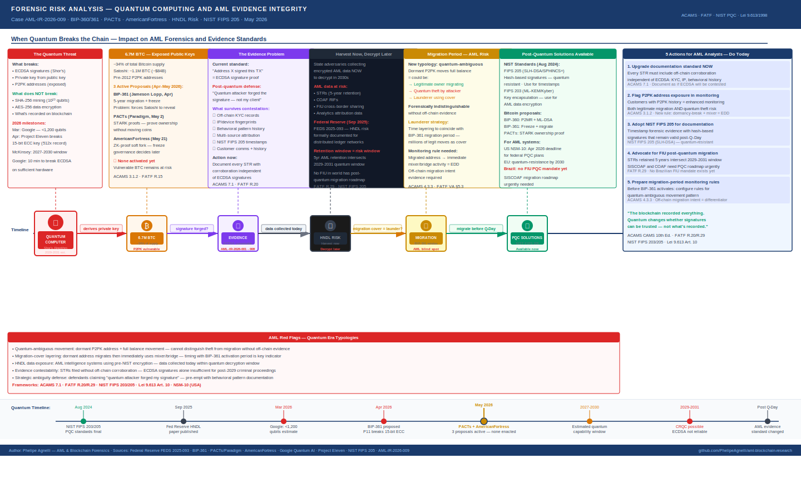

# When Quantum Breaks the Chain: What Post-Quantum Computing Means for AML Forensics

**Report:** AML-IR-2026-007 · **Author:** Phelipe Agnelli · **Date:** May 2026  
**Sources:** Federal Reserve FEDS 2025-093 (Sep 2025) · BIP-361 (Jameson Lopp et al., Apr 2026) · PACTs — Dan Robinson/Paradigm (May 2026) · AmericanFortress Protocol (May 21, 2026) · Google Quantum AI Whitepaper (Mar 2026) · Project Eleven (Apr 2026) · NIST FIPS 205 (Aug 2024) · CoinDesk · Cryptopolitan  
**Frameworks:** ACAMS CAMS 10th Ed. · FATF Recommendations · NIST Post-Quantum Cryptography Standards · Lei 9.613/1998 Art. 10

---

---

## Why This Report Exists

Every forensic analysis in this research series — from the Clifton Collins Bitcoin seizure to the Bybit $1.46B hack — rests on a single foundational assumption: **cryptographic signatures are trustworthy**. When I document that address `1GPWQv8...Ne2` authorized a transaction, I am relying on the mathematical guarantee that only the holder of the corresponding private key could have produced that ECDSA signature.

Quantum computing threatens to break that guarantee.

This is not a distant science fiction scenario. In March 2026, Google researchers estimated that breaking Bitcoin's elliptic curve cryptography may require fewer than 1,200 logical qubits and under 500,000 physical qubits — significantly lower than previous estimates. In April 2026, an independent researcher broke a 15-bit ECC key using publicly accessible quantum hardware, winning a 1 BTC bounty from Project Eleven — a 512-fold improvement over the previous record.

The quantum threat to Bitcoin is accelerating. And AML forensics has not caught up.

In this report, I document what post-quantum computing means specifically for financial crime investigation — the evidence problem, the new typologies it creates, the "harvest now, decrypt later" risk to financial intelligence data, and what analysts can do today to prepare their documentation for a post-quantum world.

---

## The Technical Foundation: What Breaks and What Doesn't

Before examining the AML implications, I document the technical reality precisely — because the threat is specific, not total.

### What quantum computers can break

Bitcoin's transaction security relies on **ECDSA (Elliptic Curve Digital Signature Algorithm)**. When a user sends Bitcoin, their private key generates a digital signature. Anyone can verify the signature using the corresponding public key — but deriving the private key from the public key is computationally infeasible for classical computers.

A sufficiently powerful quantum computer running **Shor's algorithm** can derive the private key from the public key. This means:

- Any address whose public key is exposed on-chain is potentially vulnerable
- Public keys are exposed when a transaction is made from an address — the signature reveals the public key
- **P2PK addresses** (Pay-to-Public-Key) expose the public key directly, without any transaction — meaning they are vulnerable from the moment of creation

### What quantum computers cannot easily break

**SHA-256** — the algorithm that secures Bitcoin mining — requires approximately 10²³ qubits to attack meaningfully. That is approaching the energy output of a star. Mining is not the vulnerability. Transaction signing is.

**AES-256** — the encryption standard used for most data at rest — retains approximately 128 bits of security even against quantum computers running Grover's algorithm. Properly encrypted data stored today remains secure.

The distinction matters for AML practitioners: the threat is to **transaction authentication**, not to **data encryption**. These have different implications for how we document cases and store intelligence.

---

## The Vulnerable Bitcoin: 6.7 Million BTC at Risk

Approximately **6.7 million Bitcoin — roughly 34% of the total supply** — sits in addresses considered quantum-vulnerable, primarily P2PK addresses where public keys are already exposed on-chain.

This includes the estimated **1.1 million BTC attributed to Satoshi Nakamoto**, currently worth approximately $84 billion, held in early P2PK addresses that predate modern wallet standards. These addresses have never transacted — which paradoxically makes them more vulnerable, because their public keys are exposed without the holder having had any opportunity to migrate.

### The Three Proposals of April-May 2026

The Bitcoin developer community has produced three significant proposals in the past six weeks, each addressing the vulnerable BTC problem differently:

**BIP-361 — "Post Quantum Migration and Legacy Signature Sunset"** (Jameson Lopp et al., April 2026)  
Proposes a three-phase migration plan over five years: Phase A prohibits sending new BTC to legacy address types; Phase B and C progressively restrict spending from those addresses, eventually freezing coins that fail to migrate. BIP-361 targets approximately 6.7 million BTC across P2PK and other vulnerable formats.

The problem BIP-361 creates: it forces dormant holders — including whoever controls Satoshi's addresses — to either reveal their identity by moving coins or lose access to their assets. This creates a governance crisis with no clear resolution.

**PACTs — "Provable Address-Control Timestamps"** (Dan Robinson/Paradigm, May 2, 2026)  
Addresses BIP-361's Satoshi problem directly. PACTs let holders privately timestamp cryptographic proofs of ownership today — before quantum hardware matures — and later use **STARK proofs** (quantum-resistant zero-knowledge proofs) to demonstrate control without revealing their identity or moving their coins now.

If BIP-361 is eventually activated and freezes vulnerable addresses, PACTs provide a rescue path: the holder submits a STARK proof showing they created their commitment before Q-Day, and the network releases the coins. The redemption reveals nothing about which address, which amount, or when the timestamp was created.

**AmericanFortress Protocol** (May 21, 2026 — 4 days before this report)  
The most recent proposal. Uses a backward-compatible soft fork and zero-knowledge proofs to freeze and secure vulnerable pre-BIP32 addresses, including Satoshi-era wallets, without requiring mass migrations. The protocol allows governance to later decide whether to move, burn, or redistribute the frozen funds — separating the technical protection from the governance question of what to do with Satoshi's coins.

None of these proposals has been activated. None has achieved the broad consensus required for a Bitcoin soft fork. The vulnerable BTC remains vulnerable today.

---

## AML Implication 1: The Evidence Problem

### What the problem is

In every forensic report I write, I document that a specific address authorized a specific transaction. That authorization is proven by the ECDSA signature — it is the cryptographic equivalent of a fingerprint. Courts and regulators rely on this as evidence.

A quantum computer that can derive private keys from public keys can also **forge signatures retroactively**. If a defendant's counsel can argue that a quantum attacker — not their client — produced the signatures in the transaction record, the evidentiary value of on-chain data is contestable.

This is not a theoretical concern. As the evidence standard for blockchain forensics matures in criminal proceedings globally, the question of signature authenticity will become a standard line of defense in cases where defendants have resources for sophisticated legal counsel.

### What I document today to protect against this

> **ACAMS 7.1 — Evidentiary Standards in Financial Crime Cases**  
> AML practitioners who contribute to criminal referrals must document evidence to the standard required by the relevant jurisdiction's courts. As quantum computing advances, "the blockchain shows this signature" will be insufficient — the documentation must include corroborating evidence that is not signature-dependent.

My documentation standard for cases that may result in criminal referral now includes:

**1. Off-chain corroboration**  
Exchange KYC records, IP logs, device fingerprints, customer service communications, withdrawal confirmations — anything that corroborates the on-chain evidence with data that cannot be forged by quantum signature manipulation.

**2. Behavioral pattern documentation**  
The pattern of transactions — timing, amounts, counterparties, behavioral consistency with the customer's profile — creates an evidentiary record that survives signature contestation. A quantum attacker can forge a signature; they cannot forge years of consistent behavioral history.

**3. Multi-source attribution**  
Where possible, I document attribution from multiple independent tools — Chainalysis, TRM Labs, Arkham Intelligence — rather than a single source. Convergent attribution from independent methodologies is more robust against quantum-era contestation.

**4. Timestamp the documentation itself**  
I record when each piece of evidence was collected, using timestamping methods that will remain verifiable in a post-quantum world. The NIST FIPS 205 standard (finalized August 2024) provides hash-based signature schemes that are quantum-resistant — documentation systems that adopt these standards now will produce evidence that remains trustworthy after Q-Day.

---

## AML Implication 2: The Distinction Problem

### What the problem is

If 6.7 million vulnerable BTC begins to move — whether because a quantum attacker derived the private keys, or because the legitimate owners are migrating ahead of BIP-361 — the forensic challenge is identical: **how do I distinguish theft from migration?**

Both scenarios produce the same on-chain signal: a dormant address with an exposed public key, inactive for years or decades, suddenly moves its entire balance to a new address.

This is a new AML typology that did not exist before quantum computing entered the threat landscape. I call it **"quantum-ambiguous movement"** — transactions that are forensically indistinguishable between legitimate migration and quantum theft, without off-chain evidence.

> **ACAMS 3.1.2 — Sudden Activity After Dormancy**  
> A wallet that has been dormant for years suddenly moving its full balance is a classic red flag. In the quantum era, this red flag will apply to millions of addresses simultaneously during any migration period — creating a volume of alerts that existing AML systems are not configured to handle at scale.

### What the migration period creates for AML

During any BIP-361 migration window, I expect to see:

- **Legitimate migration:** owners of vulnerable addresses moving to quantum-safe formats — generating high-volume dormancy-break patterns that are not suspicious
- **Quantum theft:** actual attackers who have derived private keys moving funds from addresses whose owners cannot prove they did not authorize the transaction
- **Strategic ambiguity:** sophisticated actors deliberately using quantum-era confusion to obscure the origin of illicit funds — "it was a quantum migration, not laundering"

An analyst facing this environment needs a monitoring framework that goes beyond the binary "dormancy break = suspicious." The key differentiator is **off-chain evidence of the owner's intent to migrate** — communications with exchanges, participation in migration coordination forums, prior registration of PACTs-style commitments — rather than the on-chain signal alone.

---

## AML Implication 3: Harvest Now, Decrypt Later

### What the problem is

The "harvest now, decrypt later" (HNDL) threat is the most immediate quantum risk for AML practitioners — because it is already happening.

State-level adversaries are collecting encrypted financial intelligence data today, storing it, and will decrypt it when sufficiently powerful quantum hardware becomes available. The Federal Reserve published a working paper in September 2025 specifically analyzing HNDL risks for distributed ledger networks.

For AML practitioners, the directly relevant data includes:

- **STRs filed under Art. 10 of Lei 9.613/1998** — retained for 5 years minimum, encrypted using current standards
- **Financial Intelligence Unit reports** — COAF RIFs (Relatórios de Inteligência Financeira) containing aggregated transaction patterns
- **Cross-border information sharing** — data exchanged between FIUs under Egmont Group protocols
- **Blockchain analytics tool outputs** — attribution data linking addresses to identified individuals

The retention window of AML data (5 years minimum) intersects directly with the quantum capability timeline (2029-2031 estimated by McKinsey and Google). Data collected and encrypted today will still be within its retention period when cryptographically relevant quantum computers may exist.

> **FATF R.29 — Financial Intelligence Unit Data Security**  
> FATF recommends that FIUs protect the confidentiality of the information they receive and produce. The HNDL threat redefines what "protect the confidentiality" means — it now requires planning for adversaries who will attempt to decrypt archived data in the future, not only those attacking it today.

### What needs to happen

The NIST FIPS 205 standard (SLH-DSA, based on SPHINCS+) provides a quantum-resistant hash-based signature scheme. The NIST FIPS 203 standard (ML-KEM, based on CRYSTALS-Kyber) provides quantum-resistant key encapsulation. Both were finalized in August 2024.

AML data systems — SISCOAF in Brazil, FinCEN's BSA filing systems in the USA, goAML globally — need migration roadmaps to NIST post-quantum standards before the quantum capability window opens. The US government has set an April 2026 deadline for federal agencies to submit post-quantum cryptography transition plans under NSM-10.

No equivalent mandate exists for AML/FIU systems in Brazil or most jurisdictions. This is a gap.

---

## AML Implication 4: The Migration Period as a Laundering Window

### What the problem is

Any BIP-361 migration period creates a window of maximum confusion for AML monitoring. During a period when millions of dormant addresses are legitimately migrating to quantum-safe formats, the signal-to-noise ratio for suspicious dormancy breaks collapses.

A sophisticated money launderer who understands this dynamic can time their layering activity to coincide with a migration period — using the cover of millions of legitimate migrations to obscure illicit fund movements that would otherwise be flagged immediately.

> **ACAMS 4.3.3 — Layering During High-Volume Events**  
> This is the crypto equivalent of structuring cash deposits to coincide with a busy business period. The technique is documented in traditional finance; its quantum-era variant has not previously been documented in an AML context.

### What I flag as a monitoring priority

During any activated BIP-361 migration window, I would configure enhanced monitoring for:

- **Newly migrated addresses** that immediately begin transacting with mixing services or cross-chain bridges
- **Migration transactions** where the destination address has prior exposure to flagged entities
- **Timing patterns** — migrations that occur in tight clusters suggesting coordination rather than independent owner-initiated activity

The distinction between a legitimate owner migrating their holdings and a launderer using migration as cover will require off-chain intelligence — not on-chain analysis alone.

---

## What Analysts Should Do Today

The quantum threat to AML forensics is real, the timeline is 2029-2031, and there are concrete actions I document as necessary now — not eventually.

**1. Upgrade your documentation standard immediately**  
Every STR and forensic report that may be used in criminal proceedings should include off-chain corroboration that does not depend on ECDSA signature validity. KYC records, behavioral patterns, multi-source attribution, and IP/device data all survive quantum-era signature contestation.

**2. Flag quantum-vulnerable address exposure in your monitoring rules**  
Any customer whose transaction history includes movement from P2PK addresses should be flagged for enhanced monitoring — both because they may be legitimate owners migrating, and because quantum theft from those addresses would appear in their transaction history.

**3. Advocate for NIST post-quantum standards in AML data systems**  
STRs filed today under 5-year retention will still be in storage when quantum hardware may exist. The institutions and regulators responsible for AML data infrastructure need to begin post-quantum migration planning now. As a practitioner, I document this recommendation in every institutional risk assessment I contribute to.

**4. Develop "quantum-ambiguous movement" monitoring rules**  
Before any BIP-361 migration is activated, configure monitoring specifically for the pattern: dormant P2PK address + full balance movement + immediate transfer to mixing service or unhosted wallet. This pattern requires a different response than a standard dormancy break — it requires off-chain investigation before any STR decision.

**5. Stay current on BIP-361, PACTs, and AmericanFortress**  
These three proposals are active as of May 2026. None has been activated. If any achieves consensus in the next 12-24 months, the AML implications — new typologies, new monitoring requirements, new evidence standards — will require immediate adaptation of existing compliance programs.

---

## Timeline: Where We Are and What's Coming

| Date | Event | AML Relevance |
|------|--------|---------------|
| Aug 2024 | NIST finalizes FIPS 203/205 — post-quantum standards | Quantum-resistant data storage now available |
| Sep 2025 | Federal Reserve publishes HNDL paper on distributed ledgers | HNDL risk formally documented for crypto/AML |
| Mar 2026 | Google: ECC-256 may require <1,200 logical qubits | Timeline accelerated — threat closer than expected |
| Apr 2026 | Project Eleven: 15-bit ECC key broken on public hardware | 512x improvement — proof of concept demonstrated |
| Apr 2026 | BIP-361 proposed — freeze 6.7M quantum-vulnerable BTC | New typology: migration vs. theft distinction problem |
| May 2026 | PACTs proposed (Paradigm) — quantum-safe ownership proof | New forensic tool: STARK-based ownership attestation |
| May 21, 2026 | AmericanFortress protocol announced | Third approach: ZK-proof freeze without mass migration |
| 2027-2030 | Estimated quantum capability window (McKinsey/Google) | AML evidence standard contestability begins |
| 2029-2031 | Cryptographically relevant quantum computer possible | ECDSA signature reliability cannot be assumed |

---

## Conclusions

Three things I take from this analysis into my daily practice:

**1. The evidence standard for blockchain forensics must evolve now.**  
Waiting for Q-Day to upgrade documentation practices is too late. STRs filed today will be used in proceedings that may occur after 2029. I document every case as if ECDSA signatures will eventually be contestable — because they will be.

**2. HNDL is not a future threat — it is a present one.**  
Adversaries are collecting AML intelligence data today for future decryption. The five-year retention mandate under Art. 10 of Lei 9.613/1998 creates a direct intersection with the quantum capability timeline. FIU data systems need post-quantum migration roadmaps now.

**3. The migration period will be the highest-risk window for AML.**  
Whenever BIP-361 or an equivalent proposal activates, the resulting period of mass address migration will create the ideal cover for sophisticated layering. Preparing monitoring rules for this scenario before it occurs is the practitioner's responsibility.

> *The blockchain has always been transparent. Quantum computing does not change what is recorded — it changes whether the signatures that authenticate those records can be trus
