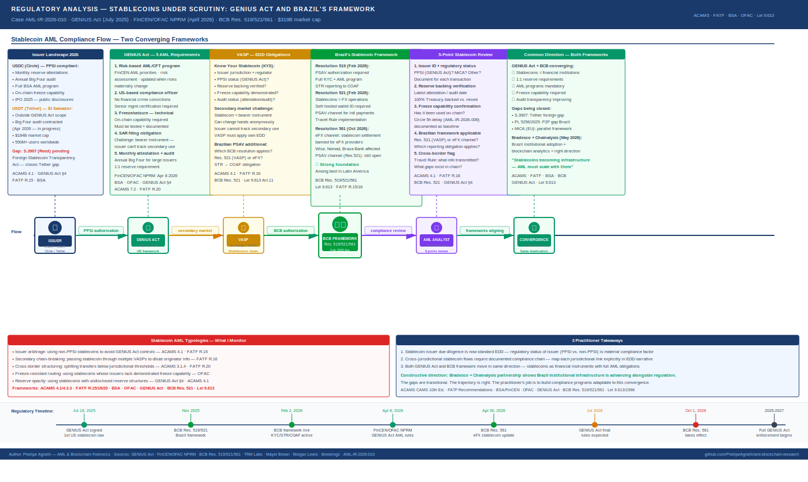

# Stablecoins Under Scrutiny: What the GENIUS Act and Brazil's Evolving Framework Mean for AML Practitioners

**Report:** AML-IR-2026-008 · **Author:** Phelipe Agnelli · **Date:** May 2026  
**Sources:** GENIUS Act (Pub.L. 119-xx, July 18 2025) · FinCEN/OFAC Joint NPRM (April 8 2026) · Federal Register 2026-06963 · BCB Resolution 519/521/561 · Greenberg Traurig · Mayer Brown · TRM Labs · Morgan Lewis · Brookings Institution  
**Frameworks:** ACAMS CAMS 10th Ed. · FATF Recommendations · BSA/FinCEN · OFAC · Lei 9.613/1998 · BCB Resolution 521/2025

---

*This report does not evaluate the policy merits of any regulatory decision. It documents the compliance implications for AML practitioners operating in this environment, with the constructive goal of supporting stronger financial crime prevention across jurisdictions.*

---

---

## Context: Why Stablecoins Are the New AML Frontier

Stablecoins have quietly become the most systemically important asset class in crypto. As of April 2026, the total stablecoin market capitalization exceeded **$319 billion** — larger than the GDP of many countries. USDT alone commands approximately 60% of that market, with over 550 million users worldwide.

For AML practitioners, stablecoins represent something traditional crypto does not: **programmable dollar-denominated value that moves at blockchain speed**. They combine the payment utility of cash with the traceability of blockchain — but also with the layering potential of any bearer instrument that can change hands anonymously across borders.

Two major regulatory developments in 2025-2026 are reshaping how compliance professionals must think about stablecoin risk: the **GENIUS Act** in the United States and Brazil's own evolving stablecoin framework. In this report, I analyze both — not to compare their merits, but to document what each requires from a practitioner working in or across these jurisdictions.

---

## Part 1 — The GENIUS Act: What It Is and What It Requires

### The law

The Guiding and Establishing National Innovation for US Stablecoins Act was signed into law on **July 18, 2025**, passing the Senate 68-30 and the House 308-122. It is the United States' first comprehensive federal legislation for digital assets — and its focus is specifically on **payment stablecoins**.

The GENIUS Act creates a new category of regulated entity: the **Permitted Payment Stablecoin Issuer (PPSI)**. Any entity that issues payment stablecoins in the United States must obtain PPSI status and comply with the Act's requirements. Non-bank PPSIs are regulated by the OCC; bank subsidiaries remain under their primary financial regulator.

### The AML obligations — what changed

Before the GENIUS Act, stablecoin issuers operated under a patchwork of state money transmitter licenses and voluntarily applied BSA obligations. The GENIUS Act ends that ambiguity.

PPSIs are now classified as financial institutions under the Bank Secrecy Act. They must build full BSA AML programs plus OFAC-aligned sanctions compliance programs — including internal controls, a designated compliance officer, training, independent testing, customer identification, suspicious activity reporting, risk assessment, screening, and recordkeeping.

On **April 8, 2026**, FinCEN and OFAC published a joint Notice of Proposed Rulemaking to implement these obligations. Comments closed June 9, 2026. Final rules are expected 12 months after issuance.

### The five core AML requirements I document for practitioners

**1. Risk-based AML/CFT program**  
PPSIs must maintain a documented, risk-based AML program — not a checklist. This means conducting a formal risk assessment of their money laundering and terrorist financing exposure, incorporating the FinCEN AML/CFT National Priorities (which include cybercrime, corruption, proliferation financing, and fraud), and updating the assessment whenever risks materially change.

**2. Compliance officer — US-based, qualified**  
The compliance officer must be located in the United States and cannot have prior convictions for financial crimes, including fraud, insider trading, or cybercrime. Senior compliance management must certify the program's adequacy. This is a meaningful governance requirement — not a formality.

**3. Freeze and seizure capability — technical, not just policy**  
The rule formalizes freeze and seizure as a technical requirement, not merely a policy commitment. PPSIs must maintain the operational ability to act on OFAC designations on-chain — formalizing what major issuers like Tether already do voluntarily. For an AML analyst, this means the freeze capability must be tested and documented, not just stated in a policy manual.

**4. Suspicious activity reporting**  
PPSIs must file SARs for transactions that meet the standard threshold of suspicion. The specific challenge for stablecoin issuers is documented by Brookings: stablecoins are digital cash — bearer instruments that can change hands anonymously; an issuer cannot easily know or control who will ultimately use its stablecoins after issuance. This creates a structural SAR challenge that bank deposit tokens do not face.

**5. Monthly reserve attestations + annual audits**  
The GENIUS Act mandates monthly reserve attestations and annual independent audits from large issuers. Tether, which previously relied on quarterly BDO attestations, contracted a Big Four firm for its first full audit in response to this legal obligation.

### The Tether question

Tether's situation illustrates the most important gap in the current framework: the GENIUS Act does not extend to foreign-domiciled issuers. Tether operates from El Salvador — and with approximately 60% of the stablecoin market, it sits entirely outside the Act's direct requirements. Senator Jack Reed reintroduced the Foreign Stablecoin Transparency Act (S.3907) to address this gap.

For an AML practitioner, this creates a direct compliance challenge: USDT — the most widely used stablecoin globally — is not subject to GENIUS Act AML obligations. Any VASP that receives USDT must apply its own EDD and monitoring standards, because the issuer-level controls that the GENIUS Act mandates for US-based issuers do not apply.

> **ACAMS 4.1 — Know Your Customer: Extended to Know Your Stablecoin**  
> The due diligence obligation for a VASP receiving stablecoin deposits now includes understanding the regulatory status of the issuer — not just the customer. A USDC deposit (Circle, regulated under GENIUS Act) carries different compliance implications than a USDT deposit (Tether, El Salvador-domiciled) for an institution building its AML risk framework.

---

## Part 2 — Brazil's Stablecoin Framework: A System Being Built in Real Time

### The foundation — BCB Resolutions 519/521

Brazil has moved rapidly to build stablecoin infrastructure. As of February 2, 2026, BCB Resolutions 519 and 521 brought stablecoin activity under the same regulatory architecture as traditional financial services — requiring KYC, AML programs, STR reporting to COAF, and asset segregation for all PSAVs.

Crucially, Resolution 521 classified stablecoin transactions as **foreign exchange operations** — bringing them inside Brazil's FX regulatory framework. This was a significant and forward-thinking step: it provides a legal structure for banks like Itaú, Bradesco, and Nubank to offer USD-pegged assets to their clients within a supervised environment.

This foundation is strong. Brazil's regulatory architecture for stablecoins is among the most comprehensive in Latin America.

### Resolution 561 — A new chapter for cross-border flows

On April 30, 2026, the BCB published Resolution BCB No. 561, effective October 1, 2026. The resolution updates Brazil's eFX (electronic foreign exchange) framework, which governs regulated international payment services.

Under the new rules, payments between an eFX provider and its foreign counterparty must move through a foreign exchange transaction or a non-resident real-denominated account in Brazil. The rule targets companies including Wise, Nomad, and Braza Bank that had built stablecoin settlement into their cross-border payment flows.

It is important to be precise about what the resolution does and does not do:

**What it does:** Closes the eFX channel for stablecoin settlement — meaning regulated payment fintechs can no longer use USDT/USDC as the backend settlement rail for international transfers.

**What it does not do:** Licensed virtual asset service providers can still use stablecoins for international payments under a separate framework, Resolution BCB No. 521, which took full effect in February 2026. Crypto trading remains fully permitted. Individual investors can still buy, sell, hold, and transfer stablecoins through authorized PSAVs.

### The AML compliance implications I document

For an AML practitioner working with Brazilian PSAVs or cross-border payment providers, Resolution 561 creates several compliance considerations worth documenting:

**Consideration 1 — Monitoring channel shift**  
When regulated channels are narrowed, transaction volume may seek alternative pathways. For an analyst, this means configuring monitoring rules that are sensitive to behavioral shifts — unusual increases in P2P activity, new counterparty patterns, or volume changes that don't match the institution's historical profile. This is not a criticism of the regulation — it is standard AML monitoring practice whenever any regulated channel changes.

> **ACAMS 5.2 — Transaction Monitoring Calibration**  
> Regulatory changes that redirect transaction flows require corresponding updates to transaction monitoring rules. An analyst whose TMS was calibrated to the pre-561 environment needs to recalibrate for the post-561 environment.

**Consideration 2 — EDD for cross-border stablecoin transactions via VASP channel**  
Transactions that previously moved through the eFX framework (with its associated regulatory oversight) may now move through the VASP framework under Resolution 521. Both frameworks have AML obligations — but they have different reporting formats, thresholds, and oversight structures. An analyst needs to understand which framework applies to each transaction type.

**Consideration 3 — The GENIUS Act intersection**  
Brazilian PSAVs that hold USDC on behalf of customers are indirectly affected by GENIUS Act requirements — because Circle (USDC issuer) must comply with the Act's AML obligations, including freeze capabilities. This creates a new due diligence consideration: when a Brazilian VASP selects which stablecoins to support, the regulatory status of the issuer is now a material compliance factor.

---

## Part 3 — The AML Challenges Common to Both Frameworks

Both the GENIUS Act and Brazil's evolving framework share a fundamental challenge that no single jurisdiction has fully resolved: **stablecoins as bearer instruments present AML risks that differ structurally from both cash and traditional bank transfers.**

### The secondary market problem

Stablecoin issuers cannot easily know or control who will ultimately be using their stablecoins after issuance. When Circle issues USDC to a VASP, that USDC may change hands dozens of times on secondary markets before being redeemed. The AML obligation at the point of issuance is clear — but the obligation for secondary transfers is distributed across potentially dozens of VASPs with varying compliance standards.

This is the structural challenge that makes stablecoin AML fundamentally different from bank AML: **the compliance obligation is fragmented across the distribution chain, not concentrated at a single regulated institution.**

### The cross-border compliance gap

A Brazilian user who holds USDT on a Brazilian PSAV and sends it to a counterparty on a foreign exchange faces a compliance chain that crosses at least three jurisdictions: Brazil (Resolution 521), the destination country's VASP regulations, and Tether's El Salvador domicile (currently outside GENIUS Act scope). Each link in that chain has different AML standards, different reporting obligations, and different enforcement mechanisms.

For the analyst documenting this transaction, the question is not which jurisdiction's rules apply — it is how to build an EDD narrative that adequately addresses the cross-jurisdictional risk without a single consolidated compliance framework to reference.

> **FATF R.16 — Travel Rule**  
> The Travel Rule requires VASPs to transmit originator and beneficiary information for virtual asset transfers. In a stablecoin transaction that crosses multiple jurisdictions — each with different Travel Rule implementation status — the analyst must document what information was available at each hop and what gaps exist in the chain. This documentation protects the institution in any subsequent regulatory review.

### What I document in practice for stablecoin transactions

For every material stablecoin transaction I review, my documentation includes:

**1. Issuer identification and regulatory status**  
Which stablecoin, which issuer, in which jurisdiction. Is the issuer a PPSI under the GENIUS Act? Is it subject to equivalent requirements in another jurisdiction?

**2. Reserve backing verification**  
For large transactions, I verify the issuer's most recent attestation or audit. A stablecoin backed 100% by US Treasuries carries different risk than one with undisclosed or diversified reserves.

**3. Freeze capability confirmation**  
Has the issuer demonstrated on-chain freeze capability? Has that capability been used? The Bybit incident (AML-IR-2026-006) documented Circle's 5-hour delay in freezing USDC — that delay is now a documented baseline for EDD on Circle counterparty risk.

**4. Brazilian regulatory framework applicable**  
Which BCB resolution governs this transaction? Resolution 521 (VASP channel) or the pre-561 eFX framework? The answer determines which reporting obligations apply and to which authority.

**5. Cross-border flag**  
Any stablecoin transaction that crosses a jurisdictional boundary receives a cross-border flag and Travel Rule documentation — recording what originator/beneficiary information was transmitted and what was unavailable.

---

## What Both Frameworks Are Building Toward

Looking at the GENIUS Act and Brazil's Resolution 521 framework together, a practitioner can identify a common direction: both are moving toward treating stablecoin issuers as financial institutions with full AML obligations, rather than technology companies with minimal compliance requirements.

This convergence is constructive. The more jurisdictions that adopt equivalent standards — 1:1 reserves, AML programs, freeze capability, audit transparency — the smaller the regulatory arbitrage gap that sophisticated actors can exploit.

The gaps that remain are transitional, not permanent:

- Tether's GENIUS Act compliance gap is being addressed legislatively (S.3907)
- Brazil's P2P monitoring gap is being addressed legislatively (PL 5256/2025)
- The secondary market problem is being addressed technically (blockchain analytics tools are improving faster than regulatory frameworks)

For an AML practitioner, the most productive posture is to document current compliance obligations precisely, anticipate where the frameworks are heading, and build monitoring programs that are adaptable as both jurisdictions continue to develop their approaches.

---

## AML Typologies — Stablecoin-Specific

| # | Typology | Framework | Risk |
|---|----------|-----------|------|
| 1 | Issuer arbitrage — using non-PPSI stablecoins to avoid GENIUS Act controls | ACAMS 4.1 · FATF R.15 | High |
| 2 | Secondary market chain-breaking — passing stablecoin through multiple VASPs to dilute originator info | FATF R.16 · ACAMS 4.3.3 | High |
| 3 | Cross-border structuring — splitting transfers to stay below jurisdictional thresholds | ACAMS 3.1.4 · FATF R.20 | High |
| 4 | Freeze-resistant routing — using stablecoins whose issuers lack demonstrated freeze capability | ACAMS 5.1.1 · OFAC | High |
| 5 | Regulatory channel arbitrage — shifting flows from regulated eFX channel to less-monitored alternatives | ACAMS 5.2 · BCB Res. 521 | Medium |
| 6 | Reserve opacity exploitation — using stablecoins with undisclosed or complex reserve structures | ACAMS 4.1 · GENIUS Act §4 | Medium |

---

## Conclusions

Three things I apply from this analysis to my daily compliance practice:

**1. Stablecoin issuer due diligence is now a standard EDD component.**  
The regulatory status of the stablecoin issuer — not just the counterparty — is a material compliance factor. I treat PPSI-compliant stablecoins differently from non-PPSI stablecoins in my risk framework.

**2. Cross-jurisdictional stablecoin flows require documented compliance chain analysis.**  
A transaction that touches Brazil (Resolution 521), the US (GENIUS Act), and a non-compliant issuer jurisdiction creates a compliance chain that no single framework fully covers. My documentation maps each link explicitly.

**3. Both frameworks are moving in the right direction — the practitioner's job is to stay current.**  
The GENIUS Act and Brazil's BCB framework are both building toward the same destination: stablecoins treated as financial instruments with full AML obligations. The gaps are real and worth documenting — but the trajectory is constructive, and an analyst who understands both frameworks is positioned to add value as that convergence continues.

> *Stablecoins are not going away. They are becoming infrastructure. The AML practitioner's job is to ensure that infrastructure is built with the same compliance standards as every other part of the financial system.*

---

## References

- GENIUS Act text: [congress.gov](https://www.congress.gov)
- FinCEN/OFAC Joint NPRM (April 8 2026): [federalregister.gov](https://www.federalregister.gov/documents/2026/04/10/2026-06963)
- TRM Labs — PPSI Rule analysis: [trmlabs.com](https://www.trmlabs.com/resources/blog/what-the-genius-act-ppsi-rule-means-for-stablecoin-issuers)
- Mayer Brown — GENIUS Act AML framework: [mayerbrown.com](https://www.mayerbrown.com/en/insights/publications/2026/04/stable-rules-for-stablecoins-treasury-proposes-aml-and-sanctions-framework-for-issuers)
- Brookings — Next steps for GENIUS payment stablecoins: [brookings.edu](https://www.brookings.edu/articles/next-steps-for-genius-payment-stablecoins/)
- BCB Resolution 519/521: [bcb.gov.br](https://www.bcb.gov.br)
- BCB Resolution 561 (April 30 2026): [bcb.gov.br](https://www.bcb.gov.br)
- Greenberg Traurig — GENIUS Act enacted: [gtlaw.com](https://www.gtlaw.com/en/insights/2025/7/genius-act-enacted-establishing-a-regulatory-framework-for-payment-stablecoins-issued-or-sold-in-the-united-states)

---

*AML-IR-2026-008 · Phelipe Agnelli — AML & Blockchain Forensics*  
*All regulatory references are public documents. This report reflects independent analysis for educational purposes. Nothing in this report constitutes legal or regulatory advice.*
