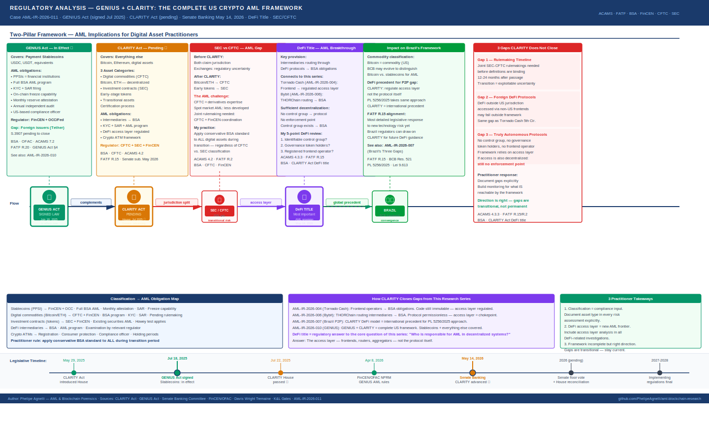

# The Complete US Crypto Framework: What GENIUS + CLARITY Mean for AML Practitioners

**Report:** AML-IR-2026-009 · **Author:** Phelipe Agnelli · **Date:** June 2026  
**Sources:** Digital Asset Market CLARITY Act (House-passed July 2025) · Senate Banking Committee Substitute (May 14, 2026) · GENIUS Act (July 18, 2025) · FinCEN/OFAC Joint NPRM (April 8, 2026) · Davis Wright Tremaine · K&L Gates · FinTech Weekly · CoinDesk · Senate Banking Committee Fact Sheets  
**Frameworks:** ACAMS CAMS 10th Ed. · FATF Recommendations · BSA/FinCEN · OFAC · CFTC · SEC · Lei 9.613/1998 (comparative)

---

*Note on legislative status: The GENIUS Act is signed law (July 18, 2025). The CLARITY Act passed the House (July 2025) and was advanced by the Senate Banking Committee (May 14, 2026). It has not yet been signed into law. This report analyzes its AML implications as currently drafted, with clear distinction between what is already in effect and what is pending.*

---

---

## Context: Two Laws, One Framework

The United States spent a decade regulating crypto through enforcement rather than legislation. The SEC sued exchanges. The CFTC claimed spot market jurisdiction. FinCEN applied BSA obligations where it could. The result was a patchwork that created uncertainty for legitimate actors and exploitable gaps for illicit ones.

In 2025-2026, that changed.

The **GENIUS Act** (signed July 18, 2025) established the first federal framework for payment stablecoins. The **CLARITY Act** — passed by the House in July 2025 and advanced by the Senate Banking Committee on May 14, 2026 — is designed to do the same for everything else: Bitcoin, Ethereum, and the broader digital asset ecosystem.

Together, these two pieces of legislation form the most comprehensive federal crypto regulatory framework the United States has ever attempted. For AML practitioners, the implications are significant — and the DeFi title of the CLARITY Act, in particular, represents a structural shift in how financial crime compliance applies to decentralized protocols.

In this report, I analyze both laws from an AML perspective — documenting what is already in effect, what is pending, and what practitioners need to prepare for now.

---

## Part 1 — GENIUS + CLARITY: The Two-Pillar Framework

### What each law covers

**GENIUS Act (in effect):**
- Payment stablecoins — USDC, USDT, and equivalents
- Permitted Payment Stablecoin Issuers (PPSIs) as financial institutions under BSA
- Full AML/CFT programs, KYC, SAR filing, freeze capability, reserve requirements
- FinCEN/OFAC joint enforcement authority

**CLARITY Act (pending):**
- Everything else — Bitcoin, Ethereum, and digital commodities
- Securities vs. commodity classification for digital assets
- Market structure for digital asset exchanges and intermediaries
- DeFi protocol regulation
- Digital asset kiosk (crypto ATM) framework

### Why the combination matters for AML

Before these laws, the fundamental question — "is this token a security or a commodity?" — had no definitive answer. The SEC argued most tokens were securities. The CFTC argued Bitcoin and Ethereum were commodities. Exchanges operated under uncertainty, which created compliance ambiguity: different classification meant different regulators, different AML obligations, and different enforcement exposure.

The CLARITY Act resolves this by establishing three distinct legal categories:

**Digital commodities** (CFTC jurisdiction): Assets on sufficiently decentralized networks — Bitcoin, Ethereum post-Merge, and others that meet decentralization criteria. No single person or entity controls the network.

**Investment contract assets** (SEC jurisdiction): Tokens where investors reasonably expect profits from the efforts of others — classic Howey test application. Most early-stage token projects.

**Transitional assets**: Assets that may evolve from one category to another as their underlying networks mature. The CLARITY Act creates a certification process for this transition.

### The AML implication of classification

For an AML practitioner, classification is not an academic exercise — it determines which regulatory framework governs the transaction monitoring, SAR filing, and enforcement exposure for every asset on a platform.

> **ACAMS 4.2 — Regulatory Classification as Risk Factor**  
> An asset whose regulatory status is uncertain carries inherently higher compliance risk than one with clear classification. The CLARITY Act's classification framework reduces that uncertainty — which is constructive for AML programs, because it enables more precise risk calibration.

Under the CLARITY Act framework, a VASP that lists Bitcoin (digital commodity) has different AML obligations than one listing an early-stage token (investment contract asset). I document this distinction in every platform risk assessment I contribute to.

---

## Part 2 — SEC vs. CFTC: The AML Gap Nobody Is Discussing

### The jurisdictional shift

The CLARITY Act grants the CFTC exclusive jurisdiction over digital commodity spot markets. This is a significant change: previously, the CFTC had limited authority over spot crypto markets (primarily anti-fraud and anti-manipulation), while the SEC claimed broad securities jurisdiction.

Under CLARITY, the CFTC becomes the primary regulator for Bitcoin and Ethereum exchanges. The SEC retains authority over investment contract assets.

### Why this creates an AML challenge

The CFTC and the SEC have very different AML enforcement architectures. The SEC operates in coordination with FinCEN on BSA obligations for its registered entities. The CFTC has experience with derivatives markets — futures, swaps, options — but its regulatory infrastructure for spot market AML monitoring is less developed than the SEC's or FinCEN's.

The CLARITY Act addresses this by making digital commodity intermediaries subject to BSA requirements — including AML programs, KYC, and suspicious activity reporting. But the implementation detail is critical: which specific FinCEN rules apply, how SAR filing thresholds are set, and how cross-agency coordination between CFTC and FinCEN works in practice will be determined by rulemaking that has not yet occurred.

> **FATF R.2 — National Cooperation and Coordination**  
> FATF requires that countries ensure their financial intelligence and regulatory authorities effectively coordinate. The GENIUS + CLARITY framework creates a three-agency coordination requirement — FinCEN, CFTC, and SEC — for different categories of digital assets. How that coordination operates in practice will determine whether the framework's AML provisions are effective or create exploitable seams.

**What I document from this gap:**

As a practitioner, I track which regulatory framework applies to each asset on any platform I review. Until CLARITY's implementing regulations are final, I apply the more conservative BSA standard — treating all digital asset intermediaries as if they are subject to full FinCEN AML requirements, regardless of whether their primary regulator is the CFTC or the SEC. This conservative approach protects the institution during the transition period.

---

## Part 3 — The DeFi Title: The Most Important AML Development in the CLARITY Act

### What the DeFi title does

The DeFi title of the CLARITY Act Senate substitute — advanced May 14, 2026 — is the first attempt by US federal legislation to directly address AML obligations for decentralized finance protocols and their intermediaries.

The key provision: **intermediaries that route activity through DeFi protocols will be expected to manage risk with examination and verification by the relevant regulator.** A separate rulemaking will clarify how a person or control group for a trading protocol could register, covering disclosures, recordkeeping, supervision, and compliance with the BSA and sanctions.

This is the regulatory response to a question that my previous reports in this series have documented extensively: who is responsible for AML compliance when the "intermediary" is autonomous code?

### How this connects to cases in this research series

**Tornado Cash (AML-IR-2026-004):**
The 5th Circuit ruled in November 2024 that OFAC could not sanction immutable smart contracts because they are not "property" under IEEPA. The CLARITY Act's DeFi title approaches the same problem differently — not by sanctioning the code, but by requiring the **intermediaries that route activity through protocols** to implement AML controls. This is a workable solution that the OFAC sanctions approach was not.

Under CLARITY, a frontend interface that routes user transactions to Tornado Cash would be an intermediary with BSA obligations. The underlying smart contract remains immutable — but the access layer becomes regulated.

**Bybit hack (AML-IR-2026-006):**
THORChain appeared as the primary laundering rail — permissionless, no KYC, no freeze mechanism. Under CLARITY's DeFi title, any entity that operates a frontend, routing service, or aggregator that channels transactions through THORChain would face AML obligations. The protocol itself remains permissionless — but the regulated access layer creates an intervention point that currently does not exist.

> **ACAMS 4.3.3 — Layering via Decentralized Protocols**  
> The DeFi title represents the first legislative acknowledgment that layering through decentralized protocols requires a different regulatory approach than traditional intermediary-based AML. Rather than imposing obligations on the protocol (which is not possible for truly decentralized systems), CLARITY imposes obligations on the access layer. This is consistent with FATF's evolving guidance on virtual assets — enforcement at the point where code meets regulated actors.

### What "sufficient decentralization" means for AML

The CLARITY Act introduces the concept of "sufficient decentralization" as the threshold for commodity classification. For AML practitioners, this concept matters because it determines whether a protocol's governance actors can be held responsible for its compliance posture.

A fully decentralized protocol — where no single entity controls the code, the governance, or the treasury — presents a different AML challenge than a protocol with an identifiable development team and governance token holders. The CLARITY Act's certification process for decentralization status creates, for the first time, a documented standard that AML practitioners can reference when assessing DeFi exposure.

**What I document when reviewing DeFi exposure:**

1. Is there an identifiable control group or development team?
2. Does the protocol have governance token holders with material voting power?
3. Is there a frontend interface or aggregator with a registered operator?
4. Does the protocol have any freeze or compliance capability?
5. Under the CLARITY Act framework, would this protocol qualify as "sufficiently decentralized"?

The answers to these questions determine whether DeFi exposure is an AML gap that can be addressed through the CLARITY framework or one that requires alternative mitigation strategies.

---

## Part 4 — Impact on Brazil's Framework

### The commodity classification precedent

Brazil's BCB framework (Resolutions 519/521) treats all virtual assets under a unified PSAV regulatory structure — it does not distinguish between Bitcoin (as a commodity) and stablecoins (as payment instruments) for AML purposes. Both require the same KYC, AML program, and STR reporting obligations.

The CLARITY Act's commodity/security distinction creates a global precedent that other jurisdictions — including Brazil — will likely incorporate in future regulatory updates. If Bitcoin is definitively classified as a commodity at the federal level in the United States, that classification will influence how other jurisdictions treat it for purposes of AML risk rating, reserve requirements, and tax treatment.

For an AML practitioner operating in Brazil, I document this as a forward-looking consideration: the BCB framework may evolve to incorporate similar distinctions as international regulatory convergence continues.

### The DeFi title and Brazil's P2P gap

Brazil's most significant AML gap — documented in AML-IR-2026-007 — is P2P crypto trading via PIX, where no regulated intermediary exists and no STR obligation applies. The CLARITY Act's approach to DeFi intermediaries offers a conceptual model for addressing this gap: rather than regulating the P2P transaction itself, regulate the access layer — the platforms, apps, and aggregators that facilitate P2P matching.

PL 5256/2025 (Senator Kajuru) is Brazil's current legislative response to the P2P gap. The CLARITY Act's DeFi title provides international precedent for the approach that bill is taking — and strengthens the case for its passage.

> **FATF R.15 — New Technologies**  
> FATF requires countries to assess ML/TF risks from emerging technologies. The CLARITY Act's DeFi framework represents the most detailed legislative response to this requirement yet produced by any major jurisdiction. Brazil's regulators can draw directly on this framework when developing their own DeFi and P2P guidance.

---

## The Three AML Gaps That CLARITY Does Not Close

In the interest of complete analysis, I document three areas where the CLARITY Act, as currently drafted, leaves meaningful AML gaps open:

**Gap 1 — The rulemaking timeline**
The CLARITY Act requires joint SEC-CFTC rulemakings to define which assets fall under which regulator. Until those rulemakings are complete — which could take 12-24 months after passage — companies operate under provisional registration without definitive clarity on which AML rules apply. The transition period creates exploitable uncertainty.

**Gap 2 — Foreign DeFi protocols**
The DeFi title applies to intermediaries subject to US jurisdiction. DeFi protocols developed and operated outside the United States — and accessed by US users through non-US frontends — may fall outside the framework's reach. This is the same jurisdictional gap that allowed Tornado Cash's developers to argue their activities were protected by the 5th Circuit ruling.

**Gap 3 — Truly autonomous protocols**
For DeFi protocols that genuinely have no identifiable control group, no governance token holders with material power, and no frontend operator — the CLARITY Act has no enforcement point. The framework relies on the access layer as the compliance chokepoint. For protocols where the access layer is also decentralized, the gap remains.

These gaps are not criticisms of the framework — they are inherent challenges of regulating technology that was specifically designed to operate without intermediaries. I document them because an AML practitioner who understands these limits can build better monitoring programs than one who assumes the framework is comprehensive.

---

## Practical Summary for AML Practitioners

| Question | Current Status | CLARITY Act Change |
|----------|---------------|-------------------|
| Is Bitcoin a commodity? | Disputed (SEC/CFTC) | Yes — CFTC jurisdiction |
| Are DeFi protocols regulated? | Not directly | Intermediaries: yes |
| Who files SARs for Bitcoin transactions? | FinCEN-registered VASPs | Same + CFTC-supervised entities |
| Is Tornado Cash-style mixing regulated? | Only at issuer/frontend level | Frontend intermediaries: BSA obligations |
| What about truly decentralized protocols? | No enforcement point | Still no enforcement point |

---

## Conclusions

Three things I apply from this analysis to my daily compliance practice:

**1. Classification is now a compliance input, not just a legal question.**  
Under the GENIUS + CLARITY framework, whether an asset is a stablecoin, a digital commodity, or an investment contract determines which regulator, which AML standard, and which SAR filing obligation applies. I document asset classification explicitly in every platform risk assessment.

**2. The DeFi access layer is the new AML frontier.**  
The CLARITY Act's most important AML contribution is the concept of intermediary liability for DeFi routing. This closes the gap that made Tornado Cash enforcement so legally contested — not by regulating the code, but by regulating the access point. As a practitioner, I now include access layer analysis in every DeFi-related investigation.

**3. The framework is incomplete but the direction is right.**  
GENIUS + CLARITY represent the most serious legislative attempt to build a comprehensive crypto AML framework in any major jurisdiction. The gaps are real and worth documenting — but the direction is constructive. An analyst who understands both the framework and its limits is better positioned than one who knows only the framework.

> *For the first time, the United States has a legislative answer to the question: "Who is responsible for AML compliance in the crypto ecosystem?" The answer is layered — stablecoin issuers, digital commodity intermediaries, DeFi access layers, and crypto ATM operators each carry defined obligations. The AML practitioner's job is to understand which layer applies to each transaction — and to document that analysis clearly.*

---

## References

- GENIUS Act (Pub.L. 119-xx, July 18 2025): [congress.gov](https://www.congress.gov)
- CLARITY Act House text (July 2025): [financialservices.house.gov](https://financialservices.house.gov)
- Senate Banking Committee substitute (May 14 2026): [banking.senate.gov](https://www.banking.senate.gov)
- FinCEN/OFAC Joint NPRM (April 8 2026): [federalregister.gov](https://www.federalregister.gov/documents/2026/04/10/2026-06963)
- Davis Wright Tremaine — Senate Banking analysis: [dwt.com](https://www.dwt.com/blogs/financial-services-law-advisor/2026/05/senate-banking-crypto-market-structure-bill)
- K&L Gates — Crypto in 2026: [klgates.com](https://www.klgates.com/Crypto-in-2026-The-Democratization-of-Digital-Assets-1-29-2026)
- FinTech Weekly — CLARITY Act explained: [fintechweekly.com](https://www.fintechweekly.com/news/what-is-the-clarity-act-digital-asset-market-structure-explained-2026)

---

*AML-IR-2026-009 · Phelipe Agnelli — AML & Blockchain Forensics*  
*All regulatory references are public documents. Legislative status as of June 2026: GENIUS Act is signed law; CLARITY Act is pending Senate floor vote and reconciliation with House text. This report reflects independent analysis for educational purposes.*
