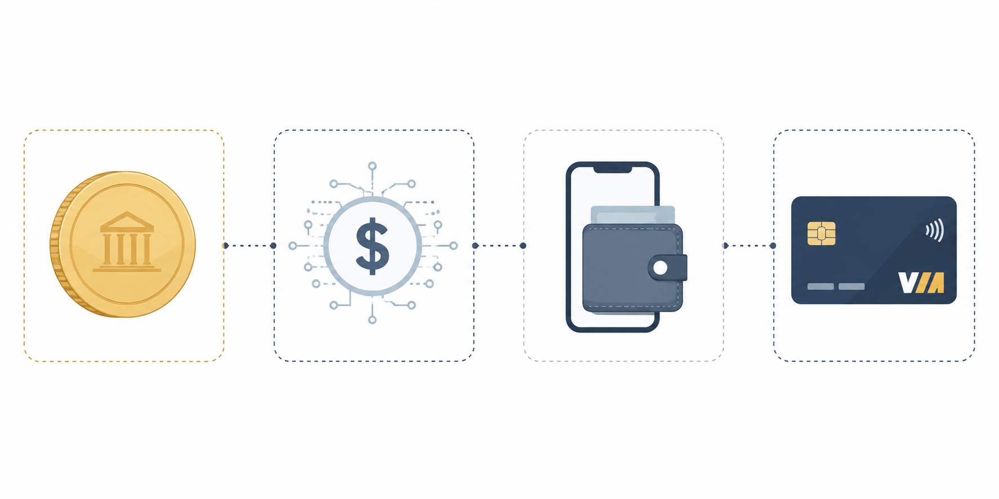

# AML-IR-2026-010
## GENIUS Act — Tether's XAUT Card and Mastercard Settlement: Emerging Stablecoin AML Challenges

**Classification:** Investigative Report
**Reference Codes:** FATF Recommendation 15 | FATF Recommendation 16 | FATF Guidance on Virtual Assets (2021, updated 2023) | FinCEN/OFAC NPRM April 8, 2026 | GENIUS Act (signed July 18, 2025) | ACAMS CAMS Body of Knowledge — Virtual Assets
**Date:** June 4, 2026
**Author:** Phelipe Agnelli | AML Analyst | Crypto Compliance Researcher
**Repository:** github.com/PhelipeAgnelli/aml-blockchain-research

**Repository:** github.com/PhelipeAgnelli/aml-blockchain-research

---

## I. Introduction

---

## I. Introduction

The passage of the GENIUS Act in July 2025 marked a significant milestone in U.S. stablecoin regulation. For the first time, permitted payment stablecoin issuers (PPSIs) operating in the United States were subject to a federal licensing framework, reserve requirements, and — following the joint FinCEN/OFAC Notice of Proposed Rulemaking (NPRM) of April 8, 2026 — explicit AML and sanctions compliance obligations including SAR filing responsibilities.

The framework represents meaningful progress. It is also, by the regulator's own admission, incomplete.

The FinCEN/OFAC NPRM explicitly carved out secondary market transactions from SAR obligations, noting that PPSIs are "generally not in a position to determine whether most secondary market activity is suspicious." This acknowledgment is significant: it establishes that the GENIUS Act's AML architecture is designed around the issuer at the point of origination, not around the full transaction chain.

Two products launched in the first week of June 2026 — Tether's XAUT gold-backed Visa card (in partnership with Fasset) and Mastercard's expanded multi-stablecoin settlement network — illustrate where that architecture may present challenges worth examining. Neither product is being characterized here as non-compliant. What they do, however, is surface structural questions that current regulation has not yet fully answered.

---

## II. The Regulatory Baseline: What the GENIUS Act Covers

The GENIUS Act established three PPSI pathways: subsidiaries of insured depository institutions (IDIs) approved by their primary federal regulator; federal qualified payment stablecoin issuers (FQPSIs) approved by the OCC; and state qualified payment stablecoin issuers approved by state regulators under a federal floor.

The April 2026 NPRM built on this foundation by requiring PPSIs to:

- Maintain risk-based AML and sanctions compliance programs, with penalties of up to $100,000 per day for non-compliance;
- File SARs for suspicious transactions above a $5,000 threshold;
- Conduct enhanced due diligence for higher-risk customers;
- Establish formal OFAC sanctions compliance programs.

Critically, the NPRM scoped SAR obligations to primary market activity — transactions between the PPSI and its direct counterparties. Secondary market transactions "between third parties that merely interact with a smart contract" were explicitly excluded, with FinCEN reasoning that requiring issuers to identify and report suspicious secondary activity "would likely lead to defensive SAR filings of limited or no intelligence value."

This boundary is not unreasonable from an operational standpoint. It does, however, define the outer edge of the regulatory perimeter. The two cases examined below operate, in material part, beyond that edge.

---

## III. Case Study 1 — Tether's XAUT Card: A Multi-Hop Transaction Chain

On June 3, 2026, Tether and Fasset announced the launch of what they described as the world's first gold-backed neobanking Visa card. The product allows users to hold Tether Gold (XAUT) — a token representing one troy fine ounce of physical gold stored in Swiss vaults — and spend globally at any Visa-accepting merchant. At the point of sale, the transaction is processed through the following conversion sequence:

**XAUT (tokenized gold, Swiss custody) → USDT (Tether, El Salvador) → local fiat (via Fasset infrastructure) → Visa merchant network**

Users additionally earn up to 6% cashback in XAUT on eligible transactions, with rewards deposited directly into their Fasset wallets. Tether committed up to $1 million in XAUT to support the rewards program at launch.

### AML Observations

**The transaction chain crosses four jurisdictions before reaching the merchant.** XAUT is issued by Tether and backed by gold held in Swiss custody. USDT is issued by Tether from El Salvador. Fasset, which provides the card infrastructure and wallet layer, holds licenses from regulators in the UAE, Indonesia, Malaysia, Turkey, Pakistan, and the EU — but not from FinCEN. The Visa network processes the final settlement.

**Each conversion step may constitute a separate reportable event under different jurisdictional frameworks**, yet no single entity in the chain has full visibility of the end-to-end transaction. Visa, as the settlement network, is not a PPSI and carries no SAR obligation under the GENIUS Act framework. Tether's USDT, issued offshore, is structurally excluded from GENIUS Act requirements for U.S. regulated markets — a gap that Senator Jack Reed's Foreign Stablecoin Transparency Act (S.3907) has attempted to address without success to date.

**The underlying asset class carries documented risk.** The FATF has specifically identified gold as a vehicle through which illicit actors seek to store or move assets as formal financial sector controls strengthen. Tokenized gold extends this characteristic into programmable, globally transferable digital form. The FATF's March 2026 report further documented that sanctions-related activity accounted for approximately 86% of illicit crypto flows in 2025, with stablecoin platforms identified as preferred vehicles.

**This does not imply that the XAUT card is being used for illicit purposes.** Fasset's multi-jurisdictional licensing profile reflects a genuine compliance posture, and the product targets underbanked markets in Asia and Africa where financial inclusion objectives are legitimate. The concern raised here is structural: the conversion sequence from XAUT to USDT to fiat to Visa creates a transaction chain in which AML monitoring is fragmented across entities that may not share intelligence, are regulated under different frameworks, and have varying SAR obligations.

**The Travel Rule question is particularly relevant here.** FATF Recommendation 16 requires that VASPs transmit originator and beneficiary information when transferring virtual assets above threshold. Whether the XAUT-to-USDT conversion within the same Tether ecosystem triggers Travel Rule obligations — and which entity bears that obligation — is a question the current framework does not clearly answer for this product structure.

---

## IV. Case Study 2 — Mastercard's Multi-Stablecoin Settlement Network

On June 3, 2026, Mastercard announced the expansion of its settlement capabilities to include six regulated stablecoins: Circle's USDC, PayPal's PYUSD, Ripple's RLUSD, and Paxos's USDG and USDP — two distinct products from the same issuer, each with independent reserve structures — alongside SoFi's SoFiUSD. The settlement network spans multiple blockchains including Arbitrum, Coinbase's Base, Canton Network, Ethereum, Polygon, Solana, Tempo, and XRPL.

The product allows Mastercard's issuer and acquirer partners — including ARQ Finance, CBW Bank, Cross River Bank, Lead Bank, and Nuvei — to choose how and when they settle transactions, with stablecoin settlement as one available option alongside traditional fiat.

### AML Observations

**Mastercard is functioning as a settlement aggregator, not as a stablecoin issuer.** This is a meaningful distinction. As a payment network, Mastercard does not carry PPSI obligations under the GENIUS Act. AML and SAR responsibilities remain anchored at the issuer layer — Circle for USDC, PayPal for PYUSD, Ripple for RLUSD, and Paxos for USDG and USDP. Each issuer operates under its own compliance framework, which may differ materially in risk tolerance, monitoring methodology, and SAR threshold interpretation.

**The question this raises is one of coordination, not attribution.** When a settlement transaction within the Mastercard network involves a conversion between two stablecoins — for example, a transaction initiated in USDC that settles in RLUSD for operational reasons — which issuer carries the monitoring obligation for that specific flow? The NPRM's secondary market carve-out may apply here, leaving the conversion without a clear SAR obligation at either issuer.

**The breadth of blockchain coverage compounds this.** Nine blockchains with different transaction finality models, different pseudonymity characteristics, and different on-chain analytics coverage creates a monitoring environment in which the same economic transaction may present very differently depending on which network leg is examined. Compliance teams at participating issuers and acquirers may not have equivalent tooling across all nine networks.

**It is worth noting that Mastercard's announcement explicitly framed the expansion as building "responsibly."** The company's track record in payment network compliance is substantial, and the participating institutions — Cross River Bank, CBW Bank, Lead Bank — are regulated entities with their own BSA obligations. The concern is not that compliance has been abandoned; it is that the aggregation model creates monitoring gaps that individual issuer compliance programs, designed for primary market activity, may not be architected to detect.

---

## V. The Structural Pattern

Examined together, the XAUT card and the Mastercard settlement network reflect the same underlying dynamic: **infrastructure designed for global reach and asset agnosticism creates AML monitoring architectures that are fragmented by design.**

Payment networks derive their value from being neutral rails. Stablecoin issuers derive their compliance obligations from primary market relationships. Neither is positioned to monitor the full chain. The GENIUS Act and the April 2026 NPRM addressed the issuer. They did not — and arguably could not — address the rail.

This dynamic is not limited to private consortia. SWIFT's blockchain-based shared ledger — currently in MVP construction with 40+ global banks and real transactions planned for 2026 — adopts the same architecture: a permissioned rail that is agnostic to the underlying asset, whether tokenized deposits or stablecoins. If the world's most systemically important financial messaging network is moving toward asset-agnostic infrastructure, the monitoring gap described in this report is not an edge case. It is the direction of the market.

This is not a criticism of the regulatory approach taken. Regulating the issuer is the appropriate starting point, and the NPRM represents genuine progress. The observation is that as infrastructure evolves — toward multi-hop conversion chains, multi-stablecoin settlement aggregation, and globally distributed fintech partnerships — the gap between where compliance obligations are assigned and where transaction risk actually manifests may widen.

---

## VI. Open Questions for Regulators and Compliance Professionals

The following questions are offered in the spirit of the ongoing NPRM comment process, the deadline for which closes June 9, 2026:

**1. Travel Rule applicability in intra-transaction conversions.** When a single user-initiated transaction involves multiple virtual asset conversions — as in the XAUT-to-USDT-to-fiat sequence — do Travel Rule obligations apply to each conversion leg? If so, which entity bears the obligation at each step?

**2. SAR coordination in multi-issuer settlement networks.** When a settlement network aggregates multiple stablecoin issuers, each with independent compliance programs, what mechanisms — if any — exist to ensure that suspicious patterns spanning multiple issuers are identified and reported? Should FinCEN consider guidance on inter-issuer information sharing for participants in common settlement networks?

**3. Jurisdictional reach for multi-hop transactions originating outside the U.S.** The XAUT card is primarily targeted at users in Asia and Africa. When such a transaction ultimately settles through Visa's global network, does any U.S. AML obligation attach? If so, at which point in the chain, and to whom?

**4. Tokenized real-world asset classification.** XAUT is a tokenized commodity, not a payment stablecoin. As tokenized gold and other real-world assets increasingly function as payment instruments via conversion-at-point-of-sale products, does the PPSI framework need to extend its perimeter to address tokenized commodity cards?

---

## VII. Conclusion

The GENIUS Act established a federal compliance baseline for stablecoin issuers that did not exist eighteen months ago. The FinCEN/OFAC NPRM of April 2026 moved that baseline closer to operational reality. Both represent meaningful progress in bringing digital asset payments within the scope of U.S. AML frameworks.

The two products examined in this report — Tether's XAUT card and Mastercard's multi-stablecoin settlement network — do not represent failures of that framework. They represent its current frontier. The infrastructure is evolving faster than the guidance, and the questions left open by the secondary market carve-out in the NPRM are now visible in live, commercially available products.

For compliance professionals working at stablecoin issuers, payment networks, and fintech partners participating in these ecosystems, the practical takeaway is clear: issuer-level AML programs designed for primary market activity may require supplemental controls and monitoring protocols when the issuer's token is deployed within multi-hop or multi-issuer infrastructure. The obligation to file may sit with the issuer. The visibility to file accurately may require coordination that the current framework does not mandate.

That is a gap worth watching.

---

*This report is prepared for educational and analytical purposes. It does not constitute legal advice. All regulatory characterizations reflect the author's independent analysis of publicly available materials.*

*Phelipe Agnelli | AML Analyst | Crypto Compliance Researcher*
*github.com/PhelipeAgnelli/aml-blockchain-research*
*LinkedIn: linkedin.com/in/phelipeagnelli*
