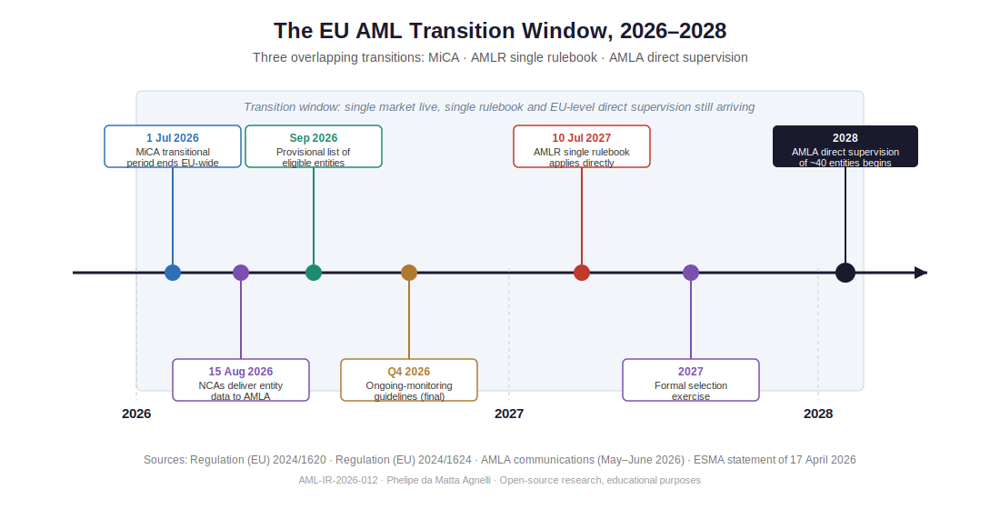

# AML-IR-2026-012 — Europe's New AML Architecture and the 2026–2028 Transition Window

**Investigative Report 12 | AML & Blockchain Forensics Research**
**Author:** Phelipe da Matta Agnelli
**Date:** 12 June 2026
**Status:** Published
**Classification:** Open-source research — educational purposes only

---

## Why I am writing this now

On 9 June 2026, the Authority for Anti-Money Laundering and Countering the Financing of Terrorism (AMLA) held its first public conference in Frankfurt — *"Building Trust, Enhancing Integrity: A New Chapter in the EU's Fight Against Financial Crime."* Two days earlier, I would have described AMLA as a framework on paper. Today, it is an institution speaking publicly about its priorities, its timeline, and — notably — the time it will need to build itself.

As a student of this field, I find the construction phase of a supervisory authority at least as instructive as its steady state. This report examines the period between mid-2026 and 2028, when three major regulatory transitions overlap in the European Union, and asks a neutral but important question: **how is AML/CFT supervision coordinated while the new architecture is still being assembled?**

A small coincidence I could not resist: this is my twelfth investigative report, and the assessment methodology at the heart of AMLA's selection process is set out in Articles 12 and 13 of its founding regulation. Report 12, on Article 12. Sometimes the numbering writes itself.

---

## 1. The new architecture in one page

The EU's 2024 AML package rests on three legal instruments:

| Instrument | Function | Key date |
|---|---|---|
| **Regulation (EU) 2024/1620 ("AMLAR")** | Establishes AMLA as the EU-level AML/CFT authority, seated in Frankfurt | Operational build-up 2025–2027 |
| **Regulation (EU) 2024/1624 ("AMLR")** | The "single rulebook" — directly applicable AML obligations for all obliged entities, no national transposition required | Applies from **10 July 2027** |
| **Directive (EU) 2024/1640 ("AMLD6")** | Governs national supervisors and Financial Intelligence Units | Transposition by Member States |

The headline innovation is direct supervision: from **2028**, AMLA will directly supervise approximately **40** of the most complex, high-risk financial institutions or groups operating in the EU. Selection follows the criteria in Articles 12–13 of Regulation (EU) 2024/1620 — broadly, cross-border activity in multiple Member States combined with a risk profile assessed across customers, products, geography, and delivery channels. Every other obliged entity — by most estimates, well over ten thousand credit institutions, payment institutions, e-money institutions, and crypto-asset service providers (CASPs) — remains under national competent authorities (NCAs), operating within AMLA's harmonised methodologies.

This is, by design, a system that comes online in stages. The interesting questions live in the stages.

---

## 2. The timeline: three transitions, one window

What caught my attention while mapping the calendar is that three separate transitions converge between July 2026 and 2028:

**Transition A — MiCA goes fully live (1 July 2026).** The Markets in Crypto-Assets Regulation's national transitional regimes expire across the EU on 1 July 2026. ESMA's statement of 17 April 2026 (ESMA75-113276571-1679) set clear expectations: CASPs without authorisation must have operational, credible, immediately executable wind-down plans, and authorised CASPs are expected to manage the migration of clients in an orderly way. From that date, the EU crypto market consists — formally — only of authorised, passportable CASPs.

**Transition B — the single rulebook is not yet in force (until 10 July 2027).** The AMLR, which harmonises customer due diligence, beneficial ownership standards, and reporting obligations across the Union, applies only from July 2027. Until then, obliged entities — including newly authorised CASPs — operate under national AML laws transposing the existing directives, with the variation between Member States that the AMLR was designed to reduce.

**Transition C — AMLA's supervisory machinery is under construction (until 2028).** The build-up is following a concrete schedule:

- **3 June 2026** — AMLA opened a public consultation on draft guidelines for the ongoing monitoring of business relationships, developed under Article 26(5) AMLR. Comments are open until **3 September 2026**, with final guidelines expected in Q4 2026.
- **15 August 2026** — deadline for national supervisors to deliver entity-level data to AMLA under the standardised reporting package published in May (and explained in AMLA's webinar of 10 June 2026).
- **End of September 2026** — AMLA expects to establish a provisional list of entities eligible for direct supervision.
- **2027** — the formal selection exercise.
- **2028** — direct supervision of the first cohort begins.

Plotted on a single line (see diagram), the picture is striking: a fully passported crypto market exists from July 2026, the harmonised rulebook arrives a year later, and EU-level direct supervision arrives a year after that.

---

## 3. Who supervises in the meantime — and why this is a legitimate research question

I want to be precise here, because precision is the difference between analysis and alarmism.

Nothing in this window is unsupervised. National competent authorities retain full responsibility for AML/CFT supervision of the entities in their jurisdictions, and the existing EBA guidelines and national frameworks continue to apply until AMLA's instruments enter into force. The transition is a planned feature of the legislation, not an oversight.

What makes the window worth studying is that the EU institutions themselves have documented the coordination challenge:

- **ESMA's peer review on CASP authorisation (July 2025)** examined the authorisation and supervision of a crypto-asset service provider by one national authority and issued recommendations addressed, in substance, to all NCAs — covering scrutiny of business models, ICT architecture, and governance. A peer review of this kind is the system working as intended; it is also formal acknowledgement that authorisation practices have varied.
- **The supervisory centralisation debate.** The European Commission has proposed shifting the supervision of significant CASPs from national authorities to ESMA, and several Member States — including France, Italy, and Austria — have publicly supported greater centralisation, arguing that divergent supervisory practices could undermine investor protection and the level playing field. Whatever the outcome, the existence of the debate at Commission and Member State level confirms that supervisory divergence is a recognised policy concern, not a researcher's speculation.
- **AMLA's own framing.** At the Frankfurt conference, the Authority's leadership was candid that building a credible supervisor takes time, and that expectations in the early years must be calibrated accordingly. I read this as institutional honesty, and it deserves to be met with analytical honesty rather than criticism.

From a financial-crime-risk perspective — the lens of my research — transition periods matter because illicit actors are documented arbitrageurs of regulatory asymmetry. The FATF's targeted updates on virtual assets (Recommendation 15) have repeatedly observed that uneven implementation across jurisdictions creates opportunities for jurisdiction-shopping by virtual asset service providers and their customers. ACAMS practitioner literature reaches the same conclusion for traditional finance: harmonisation gaps are exploited not because any single supervisor fails, but because differences between supervisors are themselves an exploitable surface.

The EU's internal market sharpens this dynamic. A CASP authorised in one Member State passports across twenty-seven. Until July 2027, the AML obligations it meets are those of its home jurisdiction's national law. The single market for services, in other words, arrives one year before the single rulebook for AML — and two years before EU-level direct supervision of the largest players.

---

## 4. What I will be watching as a student of the field

Rather than predictions, I offer a watchlist — the empirical markers that will show how the transition is actually managed:

1. **The 15 August data delivery.** The quality and consistency of entity-level data submitted by twenty-seven national supervisors, under a common template for the first time, will be an early test of the harmonised methodology. AMLA has stated the data collection exercise also calibrates its risk-assessment models.
2. **The provisional eligibility list (end of September 2026).** Which categories of institutions — and how many CASPs — meet the cross-border and risk thresholds will reveal how the crypto sector sits within the first supervisory cohort.
3. **The ongoing-monitoring guidelines (final version expected Q4 2026).** These will set supervisory expectations for transaction monitoring and customer-data refresh — operationally, the heart of AML programmes, and the area where blockchain analytics capabilities vary most across NCAs.
4. **Post-1-July market structure in crypto.** How client migration from non-authorised to authorised CASPs proceeds, and whether on-chain flows show measurable redistribution toward particular home jurisdictions — a question I intend to examine with open-source chain analytics in a future report.
5. **The outcome of the CASP-supervision centralisation debate.** If significant CASPs move to ESMA supervision while AML supervision follows the AMLA track, the coordination interface between the two authorities becomes a new and interesting seam.

---

## 5. A constructive reading

It is easy — and lazy — to describe any transition as a vulnerability. The fairer reading is that the EU has chosen depth over speed: a directly applicable regulation rather than another directive, a dedicated authority rather than an expanded mandate for an existing one, and a staged build-up rather than a premature launch. Each choice trades short-term uniformity for long-term robustness, and each was made in the open, with public consultations at every step — including one open right now, until 3 September 2026, in which any researcher or practitioner may participate.

The transition window is therefore not a flaw in the design. It *is* the design. But windows, by definition, are open for a time — and between July 2026 and 2028, the coordination among national supervisors, ESMA, and a still-under-construction AMLA is where the effectiveness of Europe's new AML architecture will quietly be decided.

That is a gap worth watching.

---

## Disclaimer

This report is an independent, open-source research exercise produced for educational purposes. It reflects the personal analysis of the author as a student and researcher of AML/CFT and blockchain forensics. It does not constitute legal, regulatory, or investment advice, does not represent the views of any institution, and is written with full respect for the authorities, institutions, and jurisdictions discussed. All information is drawn from publicly available official sources cited below. Any errors are my own; corrections are welcome.

## References

1. Regulation (EU) 2024/1620 establishing the Authority for Anti-Money Laundering and Countering the Financing of Terrorism (AMLAR) — https://eur-lex.europa.eu/eli/reg/2024/1620/oj
2. Regulation (EU) 2024/1624 on the prevention of the use of the financial system for ML/TF purposes (AMLR) — https://eur-lex.europa.eu/eli/reg/2024/1624/oj
3. Directive (EU) 2024/1640 (AMLD6) — https://eur-lex.europa.eu/eli/dir/2024/1640/oj
4. AMLA — "AMLA takes next step toward 2027 selection of entities for direct supervision" (reporting package; 15 August 2026 data deadline) — https://www.amla.europa.eu/amla-takes-next-step-toward-2027-selection-entities-direct-supervision_en
5. AMLA — Public consultation on draft guidelines on the ongoing monitoring of business relationships (3 June 2026; comments until 3 September 2026) — https://www.amla.europa.eu
6. AMLA — First AMLA Conference, "Building Trust, Enhancing Integrity," Frankfurt, 9 June 2026 — https://www.amla.europa.eu
7. ESMA — Statement on the end of the MiCA transitional period, 17 April 2026 (ESMA75-113276571-1679) — https://www.esma.europa.eu
8. ESMA — Peer review report on the authorisation and supervision of a CASP (July 2025) — https://www.esma.europa.eu
9. Regulation (EU) 2023/1114 on Markets in Crypto-Assets (MiCA) — https://eur-lex.europa.eu/eli/reg/2023/1114/oj
10. FATF — Targeted Update on Implementation of the FATF Standards on Virtual Assets and VASPs (Recommendation 15) — https://www.fatf-gafi.org
11. ACAMS — practitioner resources on EU AML reform and supervisory convergence — https://www.acams.org

---

*Report 12 of an ongoing open-source AML & blockchain forensics research series.*
*Previous: [AML-IR-2026-011] | Next: [AML-IR-2026-013 — LATAM sanctions architecture (in preparation)]*
